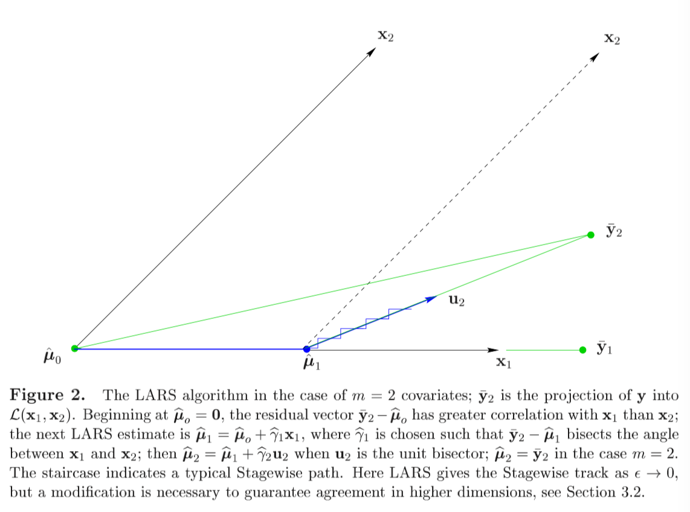

# LARS notes (Part1) (To page9,2 end)

Abstract: 

Useful and less greedy version of traditional forward selection methods.

Main property: 

- Implement the Lasso, lasso Modification: Calculates all possible Lasso estimates for a given problem.

- Different version: Another modification efficiently implements forward stagewise linear regression.

- A simple approximation for the degree of freedom of a LARS estimate is available, from which we derive a $C_p$ estimate of prediction error. thisi allws a principled choice among the range of possible LARS estimates.

  (Not quite understand the final part of the LARS goals.) 

---

LARS relates: classic model-selection method known as "forward selection" or "forward stepwise regression."

- Forward Selection

  - Given a collection of possible predictors, select the one largest absolute correlation with the response $y$, say $x_{j_1}$, and perform simple linear regression of $y$ on $x_{j_1}$ , than leaves a residual vector which is orthogonal to $x_{j_1}$. Project the other predictors orthogonally to $x_{j_1}$ nd repeat the selection process.  After k steps this results in a set of predictors $x_{j_1},...,x_{j_k}$ that are then used in the usual way to construct a k-parameter linear model.  

-  Forward stagewise

  - More cautious version of forwad selection-> take thousands tiny steps as it moves toward a final model.

  - Original motivation for the LARS algorithm.

  - LARS-Lasso-Stagewise connection is comceptually as well as computationally useful.

---

Model construction:

Predict response $y$ from covariates $x_1,\cdots,x_n$ .

By location and scale transformations we always assume that the covariates have been standardized to have mean 0 and unit length, and that the response has mean 0.
$$
\sum_{i=1}^n y_i=0\ \ \ \sum_{i=1}^n x_{ij}=0\ \ \ \sum_{i=1}^n x_{ij}^2=1\ \ \ \ \textit{for} \ \ j=1,2,...,m
$$
Regression coefficients : $\widehat { \boldsymbol { \beta } } = \left( \widehat { \beta } _ { 1 } , \widehat { \beta } _ { 2 } , \ldots , \widehat { \beta } _ { m } \right) ^ { \prime }$gives prediction vector $\hat\mu$
$$
\hat { \boldsymbol { \mu } } = \sum _ { j = 1 } ^ { m } \mathbf { x } _ { j } \hat { \beta } _ { j } = X \hat { \boldsymbol { \beta } } \quad \left[ X _ { n \times m } = \left( \mathbf { x } _ { 1 } , \mathbf { x } _ { 2 } , \ldots , \mathbf { x } _ { m } \right) \right]
$$
Total squared error
$$
S ( \widehat { \boldsymbol { \beta } } ) = \| \mathbf { y } - \widehat { \boldsymbol { \mu } } \| ^ { 2 } = \sum _ { i = 1 } ^ { n } \left( y _ { i } - \widehat { \mu } _ { i } \right) ^ { 2 }
$$
$L_1$ norm for lasso 

$$
T ( \widehat { \boldsymbol { \beta } } ) = \sum _ { j = 1 } ^ { m } \left| \widehat { \beta } _ { j } \right|
$$

$$
\textit{Lasso: minimize     }\ \ \ S(\hat\beta) \textit{subject  to }\ \ \ \ T ( \widehat { \beta } ) \leq t
$$


```Quadratic programming techniques can be used to solve (5).though we will present an easier method here, closely related to the “homotopy method” of Osborne, Presnell and Turlach (2000a)."```

---


 #### Forward Stagewise Linear Regression.


- Begins with $\hat\mu=0$ ,builds up the regression function in successive small steps.

- Let $\hat\mu$ is the current Stagewise estimate, let $\mathbf { c } ( \widehat { \boldsymbol { \mu } } )  $ be the vector of *current correlations* 

  $$\widehat { \mathbf { c } } = \mathbf { c } ( \widehat { \boldsymbol { \mu } } ) = X ^ { \prime } ( \mathbf { y } - \widehat { \boldsymbol { \mu } } )$$

- $\hat c_j$  is proportional to the correlation between covariate $x_j$ and current residual vector. Next step is taken in the direction of the greatest current correlation,

- $$
  \widehat { j } = \operatorname { argmax } \left| \widehat { c } _ { j } \right| \quad \text { and } \quad \widehat { \boldsymbol { \mu } } \rightarrow \widehat { \boldsymbol { \mu } } + \epsilon \cdot \operatorname { sign } \left( \widehat { c } _ { \hat { j } } \right) \cdot \mathbf { x } _ { \hat { j } }
  $$

- Need to mentioned here: $\epsilon$ is a "small" constant, "small" is important, otherwise "big" choice like $\epsilon=|\hat c_j|$ leads to the standard forward selection technique.  this could be over greedy.

---


The main point: 

LARS is a stylized version of the stagewise procedure that uses a simple mathematical formula to accelerate the computations.



以下是重复论文的无聊描述，参考价值有限，但是因为内容已经高度概括化所以不方便删除，以下是用中文复述一遍主要思想。下午浪费半天一个原因就是因为没注意仔细$\overline{y_2}$ 是y在$\mathcal { L } ( X )$上的投影，也就是说，如果我们只考虑$(x_1,x_2)$ ，那么$\overline y_2$ 就是目标的response. （而且在第一遍看的时候当初理解了这个事实！但是忘了orz）。

$\overline y_2$是目标response, 此时， $\overline y_2$和$x_1$ 的correlation比 $x_2$ 大，于是$\hat\mu_1$ 朝 $x_1$ 更新，然后呢，此时的residual $\overline y_2-\hat\mu_1$ 继续对$x_1$和$x_2$  找correlation. 慢慢找，直到如上图$\hat\mu_1$那个点,这时，correlation相等了，那么就停在这里，进行方向切换。而新的方向则是$x_1$和$x_2$ 的角平分线方向。而LARS的计算过程可以通过一步直接跳到这个需要换方向的点，可以极大的降低计算消耗。（是否能跳过去这里存疑） 

Each step adding one covariate to the model, after k steps just k of the $\hat\beta_j$ 's are non-zero. The figure2 showed the m=2 covariates, $X=(x_1,x_2)$ . In this case the current correlation $\widehat { \mathbf { c } } = \mathbf { c } ( \widehat { \boldsymbol { \mu } } ) = X ^ { \prime } ( \mathbf { y } - \widehat { \boldsymbol { \mu } } )$ depend only on the projection $\overline y_2$ of $y$ into the linear space $\mathcal { L } ( X )$ spanned by  $x_1$  and $x_2$ .


-  The algorithm begins at $\hat\mu_0=0$ , Figure 2 has $\overline { \mathbf { y } } _ { 2 } - \widehat { \boldsymbol { \mu } } _ { o }$  making a smaller angle with $x_1$than $x_2$ . In this case, the new correlation can be expressed as

  ​	$$\mathbf { c } ( \widehat { \boldsymbol { \mu } } ) = X ^ { \prime } ( \mathbf { y } - \widehat { \boldsymbol { \mu } } ) = X ^ { \prime } \left( \overline { \mathbf { y } } _ { 2 } - \widehat { \boldsymbol { \mu } } \right)$$	 

  Then, choose $x_1$ as the direction.
$$
  \widehat { \boldsymbol { \mu } } _ { 1 } = \hat { \boldsymbol { \mu } } _ { o } + \widehat { \gamma } _ { 1 } \mathbf { x } _ { 1 }
$$

- Stagewise would choose $\hat\gamma_1$equal to some value $\epsilon$ , than repeat many times, or make $\hat\gamma_1$ larger enough to make $\hat\mu_1$  equal $\overline y_1$ , the projection of y into $\mathcal { L } \left( \mathbf { x } _ { 1 } \right)$ .

  LARS uses an intermediate value of $\hat\gamma_1$ , the value that makes $\overline { \mathbf { y } } _ { 2 } - \widehat { \boldsymbol { \mu } }$ , equally correlated with $x_1$ and $x_2$ ; that is, $\overline y_2-\hat\mu_1$  bisects the angle between $x_1$ and $x_2$ , so $c_1(\hat\mu_1)=c_2(\hat\mu_1)$ . 

-  $u_2$be the unit vector lying along the bisector. The next LARS estimate is 

- $$
  \widehat { \boldsymbol { \mu } } _ { 2 } = \widehat { \boldsymbol { \mu } } _ { 1 } + \widehat { \gamma } _ { 2 } \mathbf { u } _ { 2 }
  $$

  With $\hat\gamma_2$chosen to make $\hat\mu_2=\overline y_2$ in the case m=2. With $m>2$ covariates , $\hat\gamma_2$ would be smaller, leading to another change of direction. 

- LARS is motivated by the fact that it is easy to calculate the step size $\hat\gamma_1,\hat\gamma_2,...$, short-circuiting the small Stagewise steps.


# *We assume that the covariate vector $x_1,x_2,...,x_m$ are linearly independent.*

For $\mathcal { A }$  a subset of the indices $\{1,2,...,m\}$ , define the matix
$$
X _ { \mathcal { A } } = \left( \cdots s _ { j } \mathrm { x } _ { j } \cdots \right) _ { j \in \mathcal { A } }
$$
when the signs $s_j$ equal $\pm 1$ . Let
$$
\mathcal { G } _ { \mathcal { A } } = X _ { \mathcal { A } } ^ { \prime } X _ { \mathcal { A } } \quad \text { and } \quad A _ { \mathcal { A } } = \left( 1 _ { \mathcal { A } } ^ { \prime } \mathcal { G } _ { \mathcal { A } } ^ { - 1 } 1 _ { \mathcal { A } } \right) ^ { - \frac { 1 } { 2 } }
$$
$1 _ { \mathcal { A } } $ being a vector of 1's of length equaling $|\mathcal{A}|$  the size of $\mathcal{A}$ . The
$$
\text { equiangular vector: }u_{A}  = X _ { \mathcal { A } } w _ { \mathcal { A } } \quad \text { where } \quad w _ { \mathcal { A } } = A _ { \mathcal { A } } G _ { \mathcal { A } } ^ { - 1 } 1 _ { \mathcal { A } }
$$
is the unit vector making equal angles, less than $90 ^ { \circ }$ , with the column of $X_\mathcal{A}$, 
$$
X _ { \mathcal { A } } ^ { \prime } \mathbf { u } _ { \mathcal { A } } = A _ { \mathcal { A } } 1 _ { \mathcal { A } } \quad \text { and } \quad \left\| \mathbf { u } _ { \mathcal { A } } \right\| ^ { 2 } = 1
$$


We saw the previous part in a negative direction. First, we look the final part (12), which should be satisfied as the equal angular .

We need find a vector $u_{\mathcal{A}}$ satisfied   $X'u=a\mathbf{1}$, now note that $\mathbb { 1 } = X ^ { \prime } X \left( X ^ { \prime } X \right) ^ { - 1 } \mathbb { 1}$. That is , we have $X'$ in the left hand side. so $u_\mathcal{A}$ have a candidate $X(X'X)^{-1}\mathbf{1}$ , then what we need to do is just standardize it.
$$
\begin{align}
u&=\frac{X(X'X)^{-1}\mathbf{1}}{\sqrt{\mathbf{1}'(X'X)^{-1}X'X(X'X)^{-1}\mathbf{1} }}\\
&=\frac{X(X'X)^{-1}\mathbf{1}}{\sqrt{\mathbf{1}'(X'X)^{-1}\mathbf{1} }}\\
&= \frac{XG^{-1}\mathbf{1}}{\sqrt{\mathbf{1}'G^{-1}\mathbf{1}}}\\
&=X G^{-1}\mathbf{1}\times A\\
&=XA^*G^{-1}\mathbf{1}\\
&=Xw
\end{align}
$$


This is how the equal-angular vector is constructed.


#### So the problem becomes to a nother one, why the form of vector making equal angles? 

$$
X _ { \mathcal { A } } ^ { \prime } \mathbf { u } _ { \mathcal { A } } = A _ { \mathcal { A } } 1 _ { \mathcal { A } } \quad
$$

That is, what is this formula mean?

Equal angular is equals to which angular????

That is, the $cos(\theta)$ between any subset $x_{i_\mathcal{A}}$  and $cos<u,x_{i_{\mathcal{A}}}>$ = $\frac{x_{i_{\mathcal{A}}}' u_{\mathcal{A}}}{||x_{i_{\mathcal{A}}}' u_{\mathcal{A}}||}$ . In this case, 

$X _ { \mathcal { A } } ^ { \prime } \mathbf { u } _ { \mathcal { A } } $ is the vector about  $x_{i_{\mathcal{A}}}' u_{\mathcal{A}}$ , then if the angular is equal, cos also should equal. However, $X'_{\mathcal{A}} $projection to the direction in $u_{\mathcal{A}}$ , then right hand side is the length of projection times 1. ($A_{\mathcal{A}}$ is a value rather a matrix.)

 

------


The describtion upon is so confusing!!!! need more clear idea about it!!!!

Then is the "fullly" describe about the LARS.

- Start with $\hat\mu_0=0$ and build up $\hat\mu$ by steps.

  Suppose current estimate is $\hat\mu_{\mathcal{A}}$ ，that $\hat c=X'(y-\hat\mu_{\mathcal{A}})$  , is the current correlations. $\mathcal{A}$ is active set which indices corresponding covariates with the greatest absolute current correlations 
  $$
  \widehat { C } = \max _ { i } \{ | \widehat { c } _ { j } | \} \quad \text { and } \quad \mathcal { A } = \left\{ j : \left| \hat { c } _ { j } \right| = \widehat { C } \right\}
  $$
  Letting 
  $$
  s _ { j } = \operatorname { sign } \left\{ \widehat { c } _ { j } \right\} \quad \text { for } \quad j \in \mathcal { A }
  $$
  we compute $X _ { \mathcal { A } } , A _ { \mathcal { A } }$ and $u_{\mathcal{A}} $ we showed previous, the equal angle trisector   and the inner product vector.
  $$
  \mathbf { a } \equiv X ^ { \prime } \mathbf { u } _ { \mathcal { A } }
  $$


  Then the next step of the LARS algorithm updates $\hat\mu_{\mathcal{A}}$, say to
$$
  \widehat { \boldsymbol { \mu } } _ { \mathcal { A } _ { + } } = \widehat { \boldsymbol { \mu } } _ { \mathcal { A } } + \widehat { \gamma } \mathbf { u } _ { \mathcal { A } }
$$
  where
$$
  \widehat { \gamma } = \min _ { j \in \mathcal { A } ^ { c } } \left\{ \frac { \widehat { C } - \widehat { c } _ { j } } { A _ { \mathcal { A } } - a _ { j } } , \frac { \widehat { C } + \widehat { c } _ { j } } { A _ { \mathcal { A } } + a _ { j } } \right\}
$$

-  还是老样子从$\hat\mu_0=0$ 开始，所以还是两件事，计算当前的correlation  $\hat c=X'(y-\hat\mu_{\mathcal{A}})$ . 其中 $\mathcal{A}$ 是一个indices set包括了每一步最大相关系数。这里有点奇怪。特别是$\hat C$ 的定义形式。

  Emmmm，是不是可以这么解释，因为开始转向的时候，$c_1=c_2$所以此时往$u_2$的方向走并不会影响$c_1$和$c_2$ 但是会影响$c_3$。 所以等走走走,$c_3$ 又会减小减小。好像不太对，residual的变化。。。。如果按figure2的话，residual对$x_1$ 的角度一直在增大，角度增大导致correlation会减小，因为$x_1$ 的$\gamma$ 在增大，$x_1$ 方向的解释越来越多，而同时，对$x_2$ 的角度一直在减小,也就是cos在增大，correlation在增大，一减一增两个过程直到这两个correlation相等


  然后回到这个过程，也就是在找了一段时间之后，有记录: $\mathcal{A}$ 。注意correlation的定义式： $\hat c=X'(y-\hat\mu_{\mathcal{A}})$ $X$ 是$n\times p$ ，$p\times n\times n\times1=p\times 1$ ，$\hat c$是此时的模型的已建模部分 $\hat\mu_{\mathcal{A}}$ 的residual关于 X的 correlation。

  按角平分线的思路,这时候在第$i$ 维的变化是主要的，$i-1$维上应该都是角平分线所以是一致的？
 A:是一致的，这时候已有的Active Set的correlation是同进同退的，过程后文中有。
  但是$\mathcal{A}$  这样定义感觉很奇怪啊。 $\mathcal{A}$里面只包含了correlation是最大的那几个，也就是说一直走一直走，走到有新的correlation能加进来，那再改变方向，重新计算$u_{\mathcal{A}}$，否则就一直按这个方向走。比如说回到figure2的图例，在一开始，最大的correlation只有$x_1$这个方向，走一小步，$x_2$ 方向的correlation还是小于$x_1$ ，所以$\mathcal{A}$还是只有{1}。直到residual 的correlation到$x_1$和$x_2$ 一致，那么就有了两个同时达到max的correlation，那就得重新计算$u_\mathcal{A}$ .  

  那这么理解就没问题了，于是下一步是通过这些东西计算步长.

-   Back to paper understanding mode

  Define: 
$$
  \boldsymbol { \mu } ( \gamma ) = \widehat { \boldsymbol { \mu } } _ { \mathcal { A } } + \gamma \mathbf { u } _ { \mathcal { A } }
$$
  for $\gamma>0 $ , so that the current correlation  

$$
c_j(\gamma)=x'_j(y-\mu(\gamma))=\hat c_j -\gamma \alpha_j.
$$

​	for $j\in \mathcal{A}$ ,  around the equation (20), the definition of correlation, max correlation, direction , yield
$$
\left| c _ { j } ( \gamma ) \right| = \widehat { C } - \gamma A _ { \mathcal { A } }
$$
 也就是当前的j的correlation，是最大correlation减去步长乘以和投影向量的长度有关的一个玩意($A_\mathcal A$)。注意，这里$j\in \mathcal{A}$ 。也就和之前描述的，因为走的是角平分线，所以这帮已经active的variable同进退。

然后下一步该考虑的就是不在$\mathcal{A}$里的j。

For $j\in \mathcal{A}^c$ , the two formula upon shows that $c_j(\gamma)$ equals the maximal value at $\gamma=（\hat C-\hat c_j)/(A_\mathcal{A}-a_j)$ . Likewise $-c_j(\gamma)$ , the current correlation for the reversed covariate $-x_j$ ,  achieves maximality at $（\hat C+\hat c_j)/(A_\mathcal{A}+a_j)$ .

Therefore $\gamma$ in (24), is the *smallest positive value of $\gamma$ such that some new index  $\hat j$ joins the active set;*  $\hat j$ is the smallest positive value of $\gamma$ such that some new index $\hat j$  joins the active set; $\hat j$ is the minimizing index in (24) , the foot length of every j in $\mathcal A^c$ . the new active set is $\mathcal { A } \cup \{ \widehat { j } \} $ , the new maximum absolute correlation is $\widehat { C } _ { + } = \widehat { C } - \hat { \gamma } A _ { A }$ . 

The figure 10 shows the LARS in diabetes data. 10 iterations for procedure from start to end. The join order or LARS is same as Lasso. However, tracks of $\hat\beta_j$ are nearly but not exactly as either the LASSO or Stagewise tracks. 


The right panel shows the absolute current correlation goes done with the LARS step k. 
$$
\widehat { C } _ { k } = \max \left\{ \left| \widehat { c } _ { k j } \right| \right\} = \widehat { C } _ { k - 1 } - \widehat { \gamma } _ { k - 1 } A _ { k - 1 }
$$


Declines with k.


---

#### Relation between LARS and OLS.

Suppose LARS has just completed step k-1, giving $\hat\mu_{k-1}$and is embarking upon step k.The active set $\mathcal{A}_k$ will have k members, giving $X _ { k } , \mathcal { G } _ { k } , A _ { k } $ and $u_k$ . Similarly, let $\overline y_k$  indicate the projection of y into $\mathcal { L } \left( X _ { k } \right)$, which, since $\widehat { \boldsymbol { \mu } } _ { k - 1 } \in \mathcal { L } \left( X _ { k - 1 } \right)$  , is 
$$
\overline { \mathbf { y } } _ { k } = \widehat { \boldsymbol { \mu } } _ { k - 1 } + X _ { k } \mathcal { G } _ { k } ^ { - 1 } X _ { k } ^ { \prime } \left( \mathbf { y } - \widehat { \boldsymbol { \mu } } _ { k - 1 } \right) = \widehat { \boldsymbol { \mu } } _ { k - 1 } + \frac { \hat { C } _ { k } } { A _ { k } } \mathbf { u } _ { k }
$$
因为等角性质和Ak里面的东西在correlation上同进退，所以有
$$
X _ { k } ^ { \prime } \left( \mathbf { y } - \widehat { \boldsymbol { \mu } } _ { k - 1 } \right) = \widehat { C } _ { k } 1 _ { \mathcal { A } }
$$
Since $ u_k$  is a unit vector, (29) ，$\overline y_k$则有 $\overline { \mathbf { y } } _ { k } - \widehat { \boldsymbol { \mu } } _ { k - 1 }$ 有长度
$$
\overline { \gamma } _ { k } \equiv \frac { \widehat { C } _ { k } } { A _ { k } }
$$
和update的那个公式进行比较，则LARS的估计$\hat\mu_k$ 在 $\hat\mu_{k-1}$到$\overline y_k$ 的延长线上.
$$
\widehat { \boldsymbol { \mu } } _ { k } - \widehat { \boldsymbol { \mu } } _ { k - 1 } = \frac { \hat { \gamma } _ { k } } { \overline { \gamma } _ { k } } \left( \overline { \mathbf { y } } _ { k } - \widehat { \boldsymbol { \mu } } _ { k - 1 } \right)
$$
可以发现一个问题, $\hat\gamma_k$  总是比 $\overline \gamma_k$小，所以 LARS estimates always approaching but never reaching the OLS estimates $\overline y_k$.

有一个情况例外，如果LARS包含了所有的covariates，然后。。。。反正就和OLS等了。

因为一步到位的性质，LARS算起来特别快。


以上的计算都没有好好看，但是大概意思结论和过程都不复杂所以先放着吧。如果有用再拿起来看。


因为typero打了那么多字好卡，所以暂时把文本分割。

 


