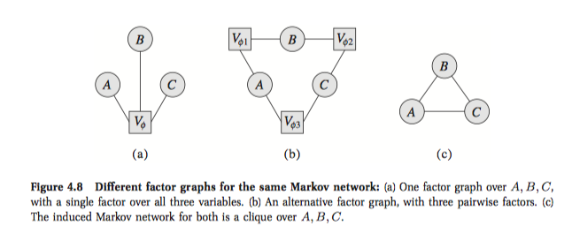

# Undirected 

## 4.4 Parameterization Revisited

我觉得我对factor的定义有问题。

### 4.4.1 Finer-Grained Parameterization

#### 4.4.1.1 Factor Graphs

##### Definition 4.13 : Factor graph

A factor graph $\mathcal F$ is an undirected graph containing two types of nodes: variable nodes (denoted as ovals) and factor nodes (denoted as squares). The graph only contains edges between variable nodes and factor nodes. A factor graph $\mathcal F$ is parameterized by a set of factors, where each factor node $V_\phi$ is associated with precisely one factor $\phi$, whose scope is the set of variables that are neighbors of $V_\phi$ in the graph. A distribution $P$ factorizes over $\mathcal F$ if it can be represented as a set of factors of this form.

Factor over several nodes in factor graph is a new nodes which link these nodes.

#### 4.4.1.2 Log-Linear Models

Factor graphs still encode factors as complete tables over the scope of the factor.

Bayesian networks, factors can also exhibit a type of context-specific structure.

We can rewrite a factor $\phi(D)$ as
$$
\phi ( \boldsymbol { D } ) = \exp ( - \epsilon ( \boldsymbol { D } ) )
$$
where $\epsilon ( \boldsymbol { D } ) = - \ln \phi ( \boldsymbol { D } )$ is called the energy function.
$$
P \left( X _ { 1 } , \ldots , X _ { n } \right) \propto \exp \left[ - \sum _ { i = 1 } ^ { m } \epsilon _ { i } \left( \boldsymbol { D } _ { i } \right) \right]
$$
Any Markov network parameterized using positive factors can be converted to a logarithmic representation.

##### Define 4.14 

Let $D$ be a subset of variables. We define a feature $f(D)$ to be a function from $Val(D)$ to $\mathbb R$. 

A feature is ismply a factor without the nonegativity requirement. One interesting type is indicator feature that takes on value 1 for some values $y\in Val(D)$ and 0 otherwise.

Val(D)这里指什么？

More general definition for our notion of log-linear models:

##### Definition 4.15 Log-linear model

A distribution P is a log-linear model over a Markov network $\mathcal H$ if it is associated with:

- a set of features $\mathcal F=\{f_1(D_1),...,f_k(D_k)\}$ , where each $D_i$ is a complete subgraph in $\mathcal H$ 

- A set of weights $w_1,...,w_k$, such that
  $$
  P \left( X _ { 1 } , \ldots , X _ { n } \right) = \frac { 1 } { Z } \exp \left[ - \sum _ { i = 1 } ^ { k } w _ { i } f _ { i } \left( \boldsymbol { D } _ { i } \right) \right]
  $$

Log-linear model provides a much more compact representation for many distributions, especially in situations where variables have large domain such as text (such as box 4.E).

Clique: 团，

A **clique**, *C*, in an [undirected graph](https://en.wikipedia.org/wiki/Undirected_graph) *G* = (*V*, *E*) is a subset of the [vertices](https://en.wikipedia.org/wiki/Vertex_(graph_theory)), *C* ⊆ *V*, such that every two distinct vertices are adjacent. This is equivalent to the condition that the [induced subgraph](https://en.wikipedia.org/wiki/Induced_subgraph) of *G* induced by *C* is a [complete graph](https://en.wikipedia.org/wiki/Complete_graph). In some cases, the term clique may also refer to the subgraph directly.

而potential function啥的都是定义在团上的。