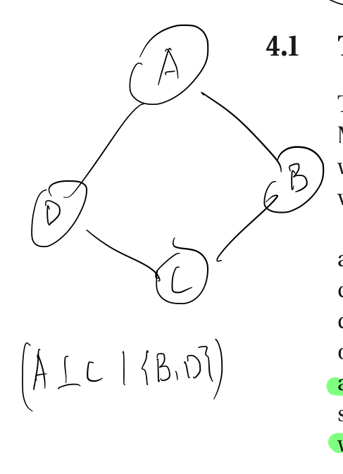
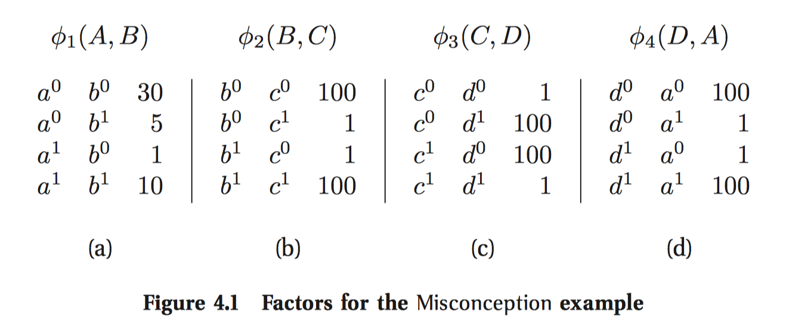
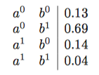
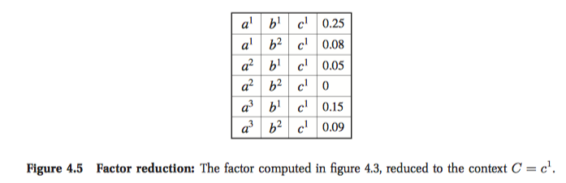
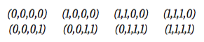
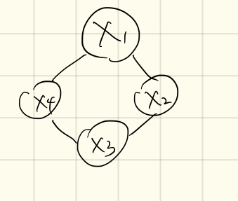

### 4.1 The misconception Example:

- Bayesian network 

  Requires that we ascribe a directionality to each influence. That is, need a "direction" rather than symmetrical.

- Undirected Graphical models: 

  Represent these correlatinos without forcing a specific direction to the influence.

Undirected Graphical models:

​	Interaction is not directed, there is no reason to use a standard CPD. Need a more symmetric parameterization. We want to capture is the affinities between related variables. For example, we might want to represent the fact that A and B are more likely to agree than to disagree. We propose a general-purpose function with A,B called a *factor* .

#### Definition 4.1

Let D be a set of random variables. We define a factor $\phi$ to be a function from $Val(D)$ to $\mathbb{R}$ . A factor is nonnegative if all its entries are nonnegative. The set of variables $D$ is called the scope of the factor and denoted $Scope[\phi]$  

$\phi_1(A,B):Val(A,B)->\mathbb R^{+}$    

The value associated with a particular assignment a,b denotes the affinity between these two values: the higher the value $\phi(a,b)$ , the more compatible these two values are.

Note that this factor is not normalized. In this case,  we have 
$$
\phi _ { 1 } \left( a ^ { 1 } , b ^ { 0 } \right) < \phi _ { 1 } \left( a ^ { 0 } , b ^ { 1 } \right)
$$
Because $1<5$ should in figure4.1(a). Thus, if A and B are disagree, there is less weight for the case where A has the misconception but B does not than for the converse case.

In a similar way, we define a compatibility foactor for each other interacting pair which showed in Figure 4.1 (b,c,d).

To define a global model, we need to combine these interactions. As in Bayesian networks, we combine the local models by multiplying them. $P(A|B)P(C|B)...etc$ so in same kind of idea, we want modelling $P(a,b,c,d)$ to be $\phi _ { 1 } ( a , b ) \cdot \phi _ { 2 } ( b , c ) \cdot \phi _ { 3 } ( c , d ) \cdot \phi _ { 4 } ( d , a )$ .

也就是想办法能把factor推广成类似于之前条件独立以及iid事件的积的形式。

But firstly, the result is not normalized. Thus, we define the distribution by taking the product.

Define:
$$
P ( a , b , c , d ) = \frac { 1 } { Z } \phi _ { 1 } ( a , b ) \cdot \phi _ { 2 } ( b , c ) \cdot \phi _ { 3 } ( c , d ) \cdot \phi _ { 4 } ( d , a )
$$
where
$$
Z = \sum _ { a , b , c , d } \phi _ { 1 } ( a , b ) \cdot \phi _ { 2 } ( b , c ) \cdot \phi _ { 3 } ( c , d ) \cdot \phi _ { 4 } ( d , a )
$$
Is a normalizing constant knowns as the *partition function*. 

The benefit of this representation is that it allows us great flexibility in representing interactions between variables. For example, if we want modify some interaction between A and B in some case, we can simply modify the entry in figure 4.1.  And the normalization constraints and interaction with other factors do not need to consider in this case.

	>as we will see later, is that the effects of these changes are not always intuitively understandable

Connection between the factorization of the distribution and its independence properties.
$$
P ( A , B , C , D ) = \left[ \frac { 1 } { Z } \phi _ { 1 } ( A , B ) \phi _ { 2 } ( B , C ) \right] \phi _ { 3 } ( C , D ) \phi _ { 4 } ( A , D )
$$
This decomposition will indicate that $P = ( B \perp D | A , C )$  and $P = ( A \perp C | B , D )$ . 

### 4.2 Parameterization

Describing the parameterization used in the class of undirected graphical models that are the focus of this chapter.

Represent a distribution should associate the graph structure with a set of parameters. (Like CPDs).  But Markov networks is not as intuitive as Bayesian networks. Factors do not correspond to probability (or conditional probability).

#### 4.2.1 Factors

Key: undirected.

> Note that a factor subsumes both the notion of a joint distribution and the notion of a CPD. A joint distribution over D is a factor over D: it specifies a real number for every assignment of values of D. A conditional distribution $P(X|U)$ is a factor over $\{ X \} \cup U$ . However, both CPDs and joint distributions must satisfy certain normalization constraints, whereas there are no constraints on the parameters in a factor.

We can view a factor as roughly describing the "compatibilities" between different values of the variables in its scope. factor可以用作大致描述不同变量在其范围内的相容性。

Intuitively, associate parameters directly with the edges in the graph. However, this approach is insufficient for full distribution.

---

##### Example 4.1 

Consider a fully connected graph over $\mathcal X$ . If all of the variables are binary, then following the pairwise factors modelling method showed in figure 4.1, then each edge will be decided by 4 parameters. Then total number would be $4 \left( \begin{array} { l } { n } \\ { 2 } \end{array} \right)$  .  However, for node $x_1,x_2,....,x_n$ , the joint distribution $P(x_1,x_2,...,x_n)$ required $2^n-1$ variables. That is, the joint distribution contains more information that pariwise factors could handle. More intuitively, such factors  caputre only the pariwise ineractions, and not interactions that involve combinations of values of larger subsets of variables. 

---

#### Definition 4.2

Let $X,Y$ and $Z$ be three disjoint sets of variables, and let $\phi_1(X,Y)$ and $\phi_2(Y,Z)$ be two factors. We define the factor product $\phi_1\times\phi_2$ to be a factor $\psi : \operatorname { Val } ( \boldsymbol { X } , \boldsymbol { Y } , \boldsymbol { Z } ) \mapsto \mathbb { R }$  as follows:
$$
\psi ( \boldsymbol { X } , \boldsymbol { Y } , \boldsymbol { Z } ) = \phi _ { 1 } ( \boldsymbol { X } , \boldsymbol { Y } ) \cdot \phi _ { 2 } ( \boldsymbol { Y } , \boldsymbol { Z } )
$$
Key aspect: two factor $\phi_1$ and $\phi_2$ are multiplied in a way that $matches\ up$ the common part $\boldsymbol Y$ .  

有点卷积(外积)的味道诶

In this way, both CPDs and joint distributions are factors. Chain rules when computing $P(A,B)=P(A)P(B|A)$  multiply entries in the $P(A)$ and $P(B|A)$ tables that have the same value for $A$ .Thus, letting $\phi _ { X _ { i } } \left( X _ { i } , \mathrm { Pa } _ { X _ { i } } \right)$ represent $P \left( X _ { i } | \mathrm { Pa } _ { X _ { i } } \right)$ , we have that 
$$
P \left( X _ { 1 } , \ldots , X _ { n } \right) = \prod _ { i } \phi _ { X _ { i } }
$$
目标还是希望用之前的手段处理条件独立性的问题，虽然不能直接使用乘法（由于Example），但是在改造乘法以后(Definition)，就可以用同样手段对joint distribution进行representation。从而达到形式上的一致（$\prod$）,但是实质上就多少有点区别（不是标准乘法。） 

---

#### 4.2.2 Gibbs Distribution and Markov Networks

After the definition for factor multiplication, we unite the form of representing Bayes Network and Markov Network. Now we can use more general notion of factor product to define an undirected parameterization of a distribution.

---

#### Definition 4.3 Gibbs distribution	

*A distribution $P_{\Phi}$ is a Gibbs distributin parameterized by a set of factors $\Phi = \left\{ \phi _ { 1 } \left( \boldsymbol { D } _ { 1 } \right) , \ldots , \phi _ { K } \left( \boldsymbol { D } _ { K } \right) \right\}$  if it is defined as follows:* 
$$
P _ { \Phi } \left( X _ { 1 } , \ldots , X _ { n } \right) = \frac { 1 } { Z } \tilde { P } _ { \Phi } \left( X _ { 1 } , \ldots , X _ { n } \right)
$$
where
$$
\tilde { P } _ { \Phi } \left( X _ { 1 } , \ldots , X _ { n } \right) = \phi _ { 1 } \left( \boldsymbol { D } _ { 1 } \right) \times \phi _ { 2 } \left( \boldsymbol { D } _ { 2 } \right) \times \cdots \times \phi _ { m } \left( \boldsymbol { D } _ { m } \right)
$$
is an unnormalized measure and 
$$
Z = \sum _ { X _ { 1 } , \ldots , X _ { n } } \tilde { P } _ { \Phi } \left( X _ { 1 } , \ldots , X _ { n } \right)
$$
is a normalizing constant called the partition function.

> It is tempting to think of the factors as representing the marginal probabilities of the variables in their scope. Thus, looking at any individual factor, we might be led to believe that the behavior of the distribution defined by the Markov network as a whole corresponds to the behavior defined by the factor. However, this intuition is overly simplistic. A factor is only one consideration the contributions from all of the factors involved.

很直接的考虑，factors表示了变量在其范围内的边际概率。这样，观察任何单独的factor，我们可能相信the behavior of Markov network定义的分布式全部对应behavior defined by factor。

也就是说-》一个factor对应一个边际概率分布，那么整个markov network的表现就能对应到每个独立factor的表现。

然而，这个直觉是过度简略了。一个factor只能表达一个贡献。

也就是说，一个单独的factor不能说明任何问题，一个factor只是考虑了包含其他所有factor贡献的一个方面。

#### Example 4.2 

The marginal distributio over A,B is

The most likely configuration is the one where Alice and Bob disagree.

But compare to figure 1

The highest entry in the factor $\phi_1$ corresponds to the assignment $a^0,b^0$ .

The reason is the influence of the other factors on the distribution. CD asserts CD disagree, and BC, DA asssert that BC agree and DA agree. Taking just these factors into consideration. we wold conclude that AB are likely to disagree. In this case, the other factors' influence is much stronger than the $\phi_1(A,B)$ factor. So that the influence of the latter is overwhelmed.  

---

Now we relate the parameterization of a Gibbs distribution to a graph structure.

> If our parameterization contins a factor whose scope contains both X and Y, we are introducing a direct interaction between them....

形式中如果有一个factor的范围包括了X和Y，那就拉一条线。。。

#### Definition: Markov network factorization and clique potentials

We say that a distribution $P_\Phi$ with $\Phi = \left\{ \phi _ { 1 } \left( \boldsymbol { D } _ { 1 } \right) , \ldots , \phi _ { K } \left( \boldsymbol { D } _ { K } \right) \right\}$  factorized over a Markov network $\mathcal H$ if each $D_k ,(k=1,...,K)$ is a complete subgraph of $\mathcal H$.

The factor that parameterize a Markov network are often called *clique potentials*.

> As we will see, if we associate factors only with complete subgraphs, as in this definition, we are not violating the independence assumptions induced by the network structure, as defined later in this chapter.

这个定义能保证网络独立性的假设。

Note that, because every complete subgraph is a subset of some (maximal) clique, we are not violating the independence assumptions induced by the network structure, as defined later in this chapter.

Consider Gibbs distribution ,have potential for every pair of variables, the Markov network associated with this distribution is a single large clique containing all variables. If we associate a factor with this single clique, it would be exponentially large in the number of variables,whereas the original parameterization in terms of edges required only a quadratic number of parameters.

 想法的关键还是使用clique来表示一个相对独立的sub-graph,然后使用factor来表示一个conditional probability。但是这个表示方法不一定好，而且可能在某些情况下有很多问题。

木有看懂以下定义。感觉是一个大的相对比较完备的sub-graph，也就是任意两点都有联系啥的。。。

Irreducible????

感觉不是，感觉得从factor下手。

Box4.A - Concept :pairwise Markov Networks.

A subclass of Markov networks is pairwise Markov networks, representing distributions where  _*All of the factors are over single variables or pairs of variables*_.  More precisely, a pairwise Markov network over a graph $\mathcal H$ is associated with a set of node potentials $\{\phi(X_i):i=1,...,n\}$ and a set of edge potentials $\left\{ \phi \left( X _ { i } , X _ { j } \right) : \left( X _ { i } , X _ { j } \right) \in \mathcal { H } \right\}$  . The overall distribution is (as always) the normalized product of all of the potentials (both node and edge). Pairwise MRFs are attractive because of their simplicity, and because interactions on edges are an important special case that often arises in practice (see, for example, box 4.C and box 4.B) 

---

#### 4.2.3 Reduced Markov Networks

Conditioning a distribution on some assignment $u$ to some subset of variables $U$ .  Conditioning a distribution corresponds to eliminating all entries in the joint distribution that are inconsistent with the event  $U=u$ , and renormalizing the remaining entries to sum to 1 

考虑一个分布，条件on assignment u，是 variable U的一个子集。 Conditioning on a distribution使得能消除所有联合分布分布中与event U=u 不相符的元，然后重新normalizing to 1.

现在考虑分布的形式$P_{\Phi}$ for some set of factors $\Phi$ .  Now, consider the case where our distribution has the form $P_{\Phi}$ for some set of factos $\Phi$ .  Each entry in the unnormalized measure $\tilde P_{\Phi}$ is a product of entries from the factors $\Phi$ , one entry from each factor. If, in some factor, we have an entry that is inconsistent with $U=u$ , it will only contribute to entries in $\tilde P_{\Phi}$ that are also inconsistent with this event. Thus, we can eliminate all such entries from every factor in $\Phi$.

$P_\Phi$ 的形式是由 $\Phi$ 确定的，更确切的来说是$\Phi$ 里面的东西乘起来。对于某些factor $\phi$ , 若有些元和$U=u$ 不一致所以我们可以把这些不一致的$\phi$ 消除掉。

More generally, we can define:

#### Define 4.5 : factor reduction

Let $\phi(Y)$ be a factor, and $U=u$ an assignment for $U \subseteq Y$ . We define the reduction of the factor $\phi$ to the context $U=u$ , denoted $\phi[U=u]$ (and abbrevlated $\phi[u]$), to be a factor over scope $Y'=Y-U$, such that 
$$
\phi[u](y')=\phi (y',u)
$$
For $U \notin Y$ , we define $\phi[u]$ to be $\phi [U'=u']$ , where $U ^ { \prime } = U \cap Y$ , and $u'=u(U')$ , where $u \left\langle U ^ { \prime } \right\rangle$ denotes the assignment in $u$ to the variables in $U^{\prime}$ . 

$\phi(Y)$, a factor.

$U=u$ , a assignment.

Reduction of the factor $\phi$ under the contex $U=u$ denote $\phi[U=u]$. scope $Y'=Y-U$ , s.t. $\phi[u](y')=\phi(y',u)$ 

也就是说，能把这个分成两块？？？

 

Factor reduction reduced to the context $C=c^1$ , that is,  we can find in the table $c$ is always 1. That is, the others that $U\neq u$ is not included in such table.  This is a clip part of figure 4.3 .

$\phi(u)$ in this case, is $\phi(c=1)$ .

$$Y'=Y-U$$ 

 $=\{a=\{0,1\},b=\{0,1\},c=\{0,1\}\}-\{c=1\}=\{a=\{0,1\},b=\{0,1\},c=\{0\}\}$ ,

$$
\phi[u] (y')=\phi(y',u)
$$
In this case, is $c=1$ factor for $(y')$, is also the factor for both suit $\phi(y',c=1)$ 

Now, consider a product of factors. An entry in the product is consistent with $u$ if and only if it is a product of entries that are all consistent with $u$ . We can therefore define:

----

#### Define 4.6: reduced Gibbs distribution

Let $P_{\Phi}$ be a Gibbs distribution parameterized by $\Phi = \left\{ \phi _ { 1 } , \dots , \phi _ { K } \right\}$  and let $u$ be a context. The reduced Gibbs distribution $P_{\Phi} [u]$ is the Gibbs distribution defined by the set of factors $\Phi[u]=\left\{ \phi _ { 1 } [ \boldsymbol { u } ] , \ldots , \phi _ { K } [ \boldsymbol { u } ] \right\}$ .

就差不多 conditional on u的感觉，但是好像有微妙的不一样。

Directly to the operation of conditioning $P_{\Phi}$ on the observation $u$, more formally:

##### Proposition 4.1

Let $P_\Phi(x)$ be a Gibbs distribution Then $P _ { \Phi } ( \boldsymbol { W } | \boldsymbol { u } ) \text { where } \boldsymbol { W } = \boldsymbol { X } - \boldsymbol { U }$ .

就是condition on it但是更形式化的表达？毕竟factor和conditional probability有些许的区别。

Condition on $u$ , that is, reduce every one of its factors to that context. renormalization step needed to account for $u$ is simply folded into the standard renormalizatin of any Gibbs distribution.

This result provides us with a construction for the Markov network that we obtain when we condition the associated distribution on some observation $u$. 

也就是说这个结论可以直接把factor和conditional distribution联系在一起，从而可以构造Markov network。

#### Definition 4.7 Reduced Markov network

Let $\mathcal H$be a Markov network over $\mathbf X$ and $U=u$ a context. The reduced Markov network $\mathcal H[u]$  is a Markov network over the nodes $W=X-U$ ， where we have an edge X—Y if htere is an edge X—Y in $\mathcal H$ .

这就是说Markov network 在已知 U的情况下，reduced了以后，还是一个Markov Network。但是是在一个去掉已知节点 U上的Markov Network。

##### Proposition 4.2

Let $P_{\Phi}(X)$ be a Gibbs distribution that factorizes over $\mathcal H$ ，and $U=u$ a context. Then $P_\Phi[u]$ factorizes over $\mathcal H[u]$ .

同样的，一个能表示$\mathcal H$ 的分布$P_{\Phi}(X)$，在已知U的情况下，也能有一个对应的$P_{\Phi}(X)[u]$ 来表达$\mathcal H[u]$ .

从图中可以看出，初始的网络，已知grade以后的reduced网络，已知Grade和SAT以后分开的网络。

（a）是full network, (b) is reduced over a context of the form $G=g$ , (c) is reduced over a context of form $G=g,S=s$ .

网络在这些情况下得到了极大的简化。

##### Box4.B- Case Study: Markov Networks for Computer Vision. 

Most of applications, network is pairwise MRF structure. Variables correspond to pixels and the edges (factors) to interactions between adjacent pixels in the grid that represents the image. 

以像素为变量，边(factor)代表毗邻的像素。使用grid方向：这样的话，每个内点有4个邻居。 而如何定义变量的取值空间，和factor的确定形式则由目标决定。

These models are usually formulated in terms of energies (negative log-potentials), 《-这个东西很奇怪诶

so that values represent "penalties," and a lower value corresponds to a higher-probability configuration.

《-惩罚项？？ 低value对应高概率设置？不太懂

###### Image denoising.

In image denoising, for example, the task is to restore the "true" value of all of the pixels given possibly noisy pixel values. 

Node potential for each pixel $X_i$ that penalizes large discrepancies from the observed pixel value $y_i$.

近的像素好，远的需要penalize.

但是需要注意不要过度惩罚"true" 的disparties. (Such as edges between objects or regions) 图片不同事物中的边缘天然就会有很大的区别。注意这是denoising的算法，也就是说，如果是一个白色的噪点，那么这个点的周围的颜色应该和这个噪点类似，当然越远的话就信息就不那么可靠。但是要注意如果是分界点，那么颜色不一样也很正常，而不是由于噪音。

Leading to oversmoothing of the image. 

所以penalty应该有界，用某些截尾的范数就不错。
$$
\epsilon \left( x _ { i } , x _ { j } \right) = \min \left( c \left| x _ { i } - x _ { j } \right| _ { p } , \operatorname { dist } _ { \max } \right) \text { for } p \in { 1,2 } )
$$

###### stereo reconstruction 立体重构？

同样的模型基于微小的变动就可以用于其他的应用。 立体重构就是为了对每个像素点进行重构深度信息。也就是使用变量表达不同的深度维。 单独的节点可以用传统方法进行估计。边的话，使用截尾的度量能强制深度的估计有一致性。penalty也可以是图像在两个像素点的逆比率 $\frac{1}{d_i-d_j}$ 之类的.

###### image segmentation

图片分割，任务是把图片的像素分割到不同区域，基于不同的场景。有很多种不同的分割任务，大部分都能用Markov network表达。 一类表达方法，叫做 multiclass segmentation, variable $X_i$ has a domain $\{ 1 , \dots , K \}$  , 用来表达像素属于的区域。（for example, grass, water, sky, car）. 计算每个点的话计算量很大，目前的技术是先分割成小区域，然后对小区域进行计算属于哪个region。小区域：super pixel or small coherent regions.

从图片中每个像素点提取特征，特征由任务的特性决定。包括颜色，文字或者location。区域可以作为聚类或者local classifier去降维。factor used 定义这个模型基于图像中像素的特定数值。所以每个图片都定义了一个不同的概率分布，对于分类的标签，for 像素或者superpixels. 在这我们主要用conditional random field. 将在4.6.1继续介绍。

###### Conditional random field

Edge potential between every pair of neightboring superpixel $X_i,X_j$.  

Making the penalty depend on the presence of an image gradient between the two pixels.

----

#### 4.3 Markov Network Independencies

Formal presentation of the undirected graph as a representation of independence assertions.

##### 4.3.1 Basic Independencies

Bayesian network: encoding a set of independence assumption.

Undirected path is blocked if condition on the intervening nodes. ????

##### Definition 4.8 Observed variable active path

Let $\mathcal H$ be a Markov network structure, and let $X_1-\cdots-X_k$  be a path in $\mathcal H$ . Let $\mathbf Z \subseteq \mathcal X$ be a set of observed variables. The path  $X_1-\cdots-X_k$is active given $\mathbf Z$ . We define the global independencies associate with $\mathcal H$ to be: 
$$
\mathcal { I } ( \mathcal { H } ) = \left\{ ( \boldsymbol { X } \perp \boldsymbol { Y } | \boldsymbol { Z } ) : \operatorname { sep } _ { \mathcal { H } } ( \boldsymbol { X } ; \boldsymbol { Y } | \boldsymbol { Z } ) \right\}
$$
这个定义的意思是，如果对于整个图上所有的path，都有X和Y被Z分开，那么久说X和Y 有 global independence.

Independence就和Bayes network一样，应该能被所有$\mathcal H$上的distribution P都要hold。 

Seperation is monotonic in Z, that is, if 如果条件在一个更大的Z上，$Z ^ { \prime } \supset Z$ , 那么在$Z'$ 上分离也满足 。

Thus, if we take separation as our definition of the independencies induced by the network structure, we are effectively restricting our ability to encode nonmonotonic independence relations. 

回想疾病的例子，如果两个疾病 independent， dependent given some common symptom. The nature of the separation property impies that such independence patterns cannot be expressed in the structure of a Markov network.

反向V形图？

###### Definition 4.9: Separation global independencies

We say that a set of nodes $\boldsymbol Z $ separates $\boldsymbol X$ and $\boldsymbol Y$ in $\mathcal H$ , denoted $\text { denoted sep } _ { \mathcal { H } } ( \boldsymbol { X } ; \boldsymbol { Y } | \boldsymbol { Z } )$ , if there is no active path between any node $X \in \boldsymbol X$ and $y\in \boldsymbol Y$ given $\boldsymbol Z$ . We define the global independencies associated with $\mathcal H$ to be:
$$
\mathcal { I } ( \mathcal { H } ) = \left\{ ( \boldsymbol { X } \perp \boldsymbol { Y } | \boldsymbol { Z } ) : \operatorname { sep } _ { \mathcal { H } } ( \boldsymbol { X } ; \boldsymbol { Y } | \boldsymbol { Z } ) \right\}
$$

##### Soundness 

Analogue to theorem 3.2, which asserts that a Gibbs distribution satisfies the independencies associated with the graph.

Theorem 3.2 Let $\mathcal G$ be a BN structure over a set of random variables $\mathcal X$ and let P be a joint distribution over the same space. If P factorizeds according to $\mathcal G$ , then $\mathcal G$ is an I-map for P. 

就和定理3.2一样，定义了分布和图的关系。

Theorem 4.1 Let P be a distribution over $\mathcal X$ , and $\mathcal H$ a Markov network structure over $\mathcal X$ . If P is a Gibbs distribution that factorizes over $\mathcal H$ , then $\mathcal H$ is an I-map for P. 

###### Proof : 

Let $\boldsymbol { X } , \boldsymbol { Y } , \boldsymbol { Z }$  be any three disjoint subsets in $\mathcal X$ such that $\boldsymbol { Z }$  separates $\boldsymbol { X}$ and $\boldsymbol { Y}$ in $\mathcal H$. We want to show that $P = ( \boldsymbol { X } \perp \boldsymbol { Y } | \boldsymbol { Z } )$ .

We start by considering the case where $\boldsymbol { X } \cup \boldsymbol { Y } \cup \boldsymbol { Z } = \mathcal { X }$ . As $\boldsymbol {Z} $ separates $\boldsymbol { X} $ from $\boldsymbol { Y}$ , there are no direct edges between $\boldsymbol { X}$ and $\boldsymbol { Y }$ . Hence, any clique in $\mathcal H$ is fully contained either in $\boldsymbol { X } \cup \boldsymbol { Z }$  or in $\boldsymbol { Y } \cup \boldsymbol { Z }$. Let $\mathcal { I } _ { \mathbf { X } }$ be the indexes of the set of cliques that are contained in $\boldsymbol { X } \cup \boldsymbol { Z }$ , and let $\mathcal I_\mathbf Y$ be the indexes of the remaining cliques. We know that
$$
P \left( X _ { 1 } , \ldots , X _ { n } \right) = \frac { 1 } { Z } \prod _ { i \in \mathcal I _ { X } } \phi _ { i } \left( \boldsymbol { D } _ { i } \right) \cdot \prod _ { i \in \mathcal { I } _ { Y } } \phi _ { i } \left( \boldsymbol { D } _ { i } \right)
$$
As we discussed, none of the factors in the first product involve any variable in $\boldsymbol {Y}$ , and none in the second product involve any variable in $\mathbf X $ . Hence, we can rewrite this product in the form :
$$
P \left( X _ { 1 } , \ldots , X _ { n } \right) = \frac { 1 } { Z } f ( \boldsymbol { X } , Z ) g ( \boldsymbol { Y } , \boldsymbol { Z } )
$$
From this decomposition, the desired independence follows immediately.

Now consider the case where $\boldsymbol { X } \cup \boldsymbol { Y } \cup \boldsymbol { Z } \subset \mathcal { X }$ . Let $\boldsymbol { U } = \mathcal { X } - ( \boldsymbol { X } \cup \boldsymbol { Y } \cup \boldsymbol { Z } )$ . We can partition $U$ into two disjoint sets $U_1$ and $U_2$ such that $\boldsymbol Z$ separates $\boldsymbol { X } \cup \boldsymbol { U } _ { 1 }$  from $\boldsymbol { Y } \cup \boldsymbol { U } _ { 2 }$ in $\mathcal H$ . Using the preceding argument, we conclude that $P = \left( \boldsymbol { X } , \boldsymbol { U } _ { 1 } \perp \boldsymbol { Y } , \boldsymbol { U } _ { 2 } | \boldsymbol { Z } \right)$  . Using the decomposition property (equation (2.8)), we conclude that $P = ( X \perp Y | Z )$ .  $\tag*{$\blacksquare$}$

Equation (2.8) $( \boldsymbol { X } \perp \boldsymbol { Y } , \boldsymbol { W } | \boldsymbol { Z } ) \Longrightarrow ( \boldsymbol { X } \perp \boldsymbol { Y } | \boldsymbol { Z } )$ 

Theorem 3.1 Let $\mathcal G$ be a BN structure over a set of random variables $\mathcal X$ , and let P be a joint distribution ver the same space. If $\mathcal G$ is an I-map for P, then P factorizes according to $\mathcal G$ .

The other direction (the analogue to theorem 3.1), which goes from the independence properties of a distribution to its factorization, is known as the *Hammersley-Clifford theorem*. Unlike for Bayesian networks, the direction does not hold in general.  It holds only under the additional assumption that P is a positive distribution. 

Definition 2.5 : Positive distribution

A distribution P is said to be positive if for all events $\alpha \in S$ wuch that $\alpha \neq \emptyset$ , we have that $P(\alpha)>0$ . 

###### Theorem 4.2 :

Let P be a positive distribution ov $\mathcal X$ , and $\mathcal H$ a Markov network graph over $\mathcal X$ . If $\mathcal H$ is an I-map for P, then P is a Gibbs distribution that factorizes over $\mathcal H$. 

To prove this result, independence assumption need to be used to construct a set of factor over $\mathcal H$ that give rise to the distribution P. 

In the case of Bayesian networks, these factors were simply CPDs, which we could derive directly from P. The Markov Network correspondence between the factors in a Gibbs distribution and distribution P is much more indirect. That is, it may influence others via the edge between each other.

The construction for Markov Network is more subtle, and relies on concepts that we develop later.

**This result shows that, for positive distribution, the global independencies imply that the distribution factorizes according the network structure. Thus for this class of distributions, we have that a distribution P factorizes over a Markov network $\mathcal H$  if and only if $\mathcal H$ is an I-map of P. ** The positivity assumption is necessary for this result to hold:

##### Example 4.4

Consider a distribution P over four binary random variables $X_1,X_2,X_3,X_4$ , which gives probability 1/8 to each of the following eight configurations, and probability zero to all others: 

 

Let $\mathcal H$ be the graph $X _ { 1 } - X _ { 2 } - X _ { 3 } - X _ { 4 } - X _ { 1 }$ . Then P satisfies the global independencies with respect to $\mathcal H$ . 

For example, consider the independence $\left( X _ { 1 } \perp X _ { 3 } | X _ { 2 } , X _ { 4 } \right)$ . 

For the assignment $X _ { 2 } = x _ { 2 } ^ { 1 } , X _ { 4 } = x _ { 4 } ^ { 0 }$ , We have that only assignments where $X_1 =x^1_1$ receive positive probability. 

Thus, $P(x^1_1|x^1_2,x^0_4)=1$ , and $X_1$  is trivially independent of $ X_3$in this conditional distribution.  A similar analysis applies to all other cases, so that the global independencies hold. However, the distribution P does not factorize according to $\mathcal H$ . 

> 以上内容没看懂，assignment这里指啥，为啥从receive positive probability 就变成thus，概率为1了。
>
> 由于只有那八种形式，所以要么是(1,1,0,0)要么是(1,1,1,0)

###### 4.3.1.2 Completeness

Preceding part shows the soundness of separation condition as a criterion for detecting independencies in Markov networks:  Any distribution that factorizes over $\mathcal G$ satisfies the independence assertions implied by separation. The next obvious issue is the completeness of this criterion.

Not like Bayes network, the strong version of completeness do not hold in this setting. 

> It is not the case that every pair of nodes $X$and $Y$ are not separated in $\mathcal H$ are dependent in every distribution P which factorizes over $\mathcal H$ . We can use weaker definition of completeness that does hold. 

##### Theorem 4.3

Let $\mathcal H$ be a Markov network structure. If $X$ and $Y$ are not separated given $\boldsymbol Z$  in $\mathcal H$, then $X$ and $Y$ are dependent given $\boldsymbol Z$ in some distribution P that factorizes over $\mathcal H$ .

Proof: The proof is a constructive one: we construct a distribution P that factorizes over $\mathcal H$ where $X$ and $Y$ are dependent. We assume, without loss of generality, that all variables are binary-valued. If this is not the case, we can treat them as binary-valued by restricting attention to two distinguished values for each variable.

构造性证明，假设 X Y dependent， 先考虑binary的情况。

在$\mathcal H$ 中给定X,Y并不能被Z分开，所以X，Y一定存在一条能连接的轨道。不妨设$X = U _ { 1 } - U _ { 2 } - \ldots - U _ { k } = Y$  为某一条最短路径 s.t. 对于所有i，$U _ { i } \notin Z$ , 由于我们定义的路径是最短的，所以不存在捷径。也就是说，对所有i and $j \neq i \pm 1$  , there is no edge $U_i-U_j$ for $j>i+1$ . 也就是说，因为$X=U_1-U_2...-U_k=Y$ 是最短路径，所以$U_1$和$U_3$ 之间肯定没有连接。否则就能构造一个更短的路径了。

For any $i=1,..,k-1$, as there is an edge $U_i-U_{i+1}$ s.t. both appear in some clique $C_i$. Use $C_i$ to define clique potential $\phi_i(C_i)$ with some very large weight $W$  if $U_i=U_{i+1}$ and weight 1 otherwise, regardless of the values of the other variables in the clique.   Clique $C_i$ for $U_i,U_{i+1}$ and $C_j$ for $U_j,U_{j+1} $ must be different cliques : If $C_i=C_j$ , then $U_j$ is in the same clique as $U_i$, and we have an edge $U_i-U_j$, contradicting the minimality of the trail. Hence, we can define the clique potential for each clique $C_i$ separately. We define the clique potential for any other clique to be uniformly 1.

用clique $C_i$ 定义clique potential $\phi_i(C_i) $. 

这样，就从图推导到clique potential，可以直接从clique中得到。

然后考虑分布P，来自于以上定义的clique potential $\phi_i(C_i)$ ，一般来说$P(U_1,...,U_k)$ 是定义为两两对应的factor乘起来。 可以验证，$P \left( U _ { 1 } , \dots , U _ { k } \right)$ 中，$X=U_1$ and $Y=U_k$ are dependent.  $ \tag*{$\blacksquare$} $

 可以利用theorem 3.5同样的思路，对于几乎所有distribution $P$ 对$\mathcal H$ 进行分解，(that is, for all distributions except for a set of measure zero in the space of factor parameterizations) we have that $\mathcal I(P)=\mathcal I(\mathcal H)$.  In this case, $\mathcal I (P)$ is the maximal one.

Review the independence in a Bayesian network, there are two definition: the local independencies (each node is independent of its nondescendants given its parents ), the global independencies induced by d-separation. And these two sets of independencies are equivalent, in that one implies the other.

Markov network provides only a global criterion, which induced by the network structure. Local criterion is also valuable, since it allows us to focus on a smaller set of properties when examining the distribution. Simplify the process of finding an I-map for a distribution P.

That is, it is naturally to extend the local independence from Bayesian network to Markov network. There are three different posible definitions of the independencies associated with the network structure- two local ones and the global one in definition 4.9. These three definitions are related, equivalent only for positive distributions.

Non-positive distribution would allow for deterministic dependencies between the variables, which can "fool" local independence tests, allowing us to construct networks that are not I-maps of the distribution, when the local independencies hold.

###### Local Markov Assumptions

Firstly, the weakest definition is based on the following intuition:

Whenever two variables are directly connected,  they have the potential of being directly correlated in a way that is not mediated by other variables.  Conversely, two variables are not directly linked, there must be some way to construct  conditionally independent. Specifically, maybe X and Y be independent conditional on all other nodes in the graph.

###### Definition 4.10: pairwise independencies

Let $\mathcal H$ be a Markov network, We define the pairwise independencies associated with $\mathcal H$ to to be:
$$
\mathcal { I } _ { p } ( \mathcal { H } ) = \{ ( X \perp Y | \mathcal { X } - \{ X , Y \} ) : X - Y \notin \mathcal { H } \}
$$
Using this definition, we can easily represent the independencies in our Misconception example using a Markov network.

###### Definition 4.11: Markov blanket, local independencies

For a given graph $\mathcal H$ , we define the Markov blanket of $X $  in $\mathcal H$ , denoted $\textit{MB}_\mathcal H (X)$, to be the neighbors of $X$ in $\mathcal H$ . We define the local independencies associated with $\mathcal H$ to be :
$$
\mathcal { I } _ { \ell } ( \mathcal { H } ) = \left\{ \left( X \perp \mathcal { X } - \{ X \} - \operatorname { MB } _ { \mathcal { H } } ( X ) | \operatorname { MB } _ { \mathcal { H } } ( X ) \right) : X \in \mathcal { X } \right\}
$$
Pairwise independencies is conditional on all other nodes than independent. Local independencies is conditional on the neighbors of $X$ in $\mathcal H$, than X is independencies with all other point in X except X and its neighbors.

##### 4.3.2.2 Relationships between Markov Properties

We have now presented three sets of independence assertions associated with a network structure $\mathcal H$. $\mathcal I_p(\mathcal H)$ is strictly weaker than $\mathcal I_\ell (\mathcal H)$ , which in turn is strictly weaker than $\mathcal I(\mathcal H)$ .

>  $\mathcal I(\mathcal H)$ is the global independencies, which is $\mathcal { I } ( \mathcal { H } ) = \left\{ ( \boldsymbol { X } \perp \boldsymbol { Y } | \boldsymbol { Z } ) : \operatorname { sep } _ { \mathcal { H } } ( \boldsymbol { X } ; \boldsymbol { Y } | \boldsymbol { Z } ) \right\}$  $\boldsymbol Z$ separate any active path between $\boldsymbol X$ and $\boldsymbol Y$

###### Proposition 4.3 For any Markov network $\mathcal H$, and any distribution $P$,we have that if $P = \mathcal { I } _ { \ell } ( \mathcal { H } )$  then $P = \mathcal { I } _ { p } ( \mathcal { H } )$ .

###### Proposition 4.4 For any Markov network $\mathcal H$, and any distribution $P$,we have that if $P = \mathcal { I }  ( \mathcal { H } )$  then $P = \mathcal { I } _ { \ell } ( \mathcal { H } )$ .

###### Theorem 4.4 Let $P$ be a positive distribution. If $P$ satisfies $\mathcal I_p(\mathcal H)$, then $P$ satisfies $\mathcal I (\mathcal H)$ . 

Proof: We want to prove that for all disjoint sets $\boldsymbol { X } , \boldsymbol { Y } , \boldsymbol { Z }$:
$$
\operatorname { sep } _ { \mathcal { H } } ( \boldsymbol { X } ; \boldsymbol { Y } | \boldsymbol { Z } ) \Longrightarrow P = ( \boldsymbol { X } \perp \boldsymbol { Y } | \boldsymbol { Z } )
$$
The proof proceeds by descending induction on the size of $\boldsymbol Z$.

一开始,$| \boldsymbol { Z } | = n - 2$ ; 由 $\mathcal I_p (\mathcal H)$, 的定义，等式成立。

接下来对指标进行推导。 假设上式对任意 $\boldsymbol Z'$ with $|\boldsymbol Z'|=k$ , and let $\boldsymbol Z$ be any set such that $|\boldsymbol Z|=k-1$. We distinguish between two cases.

第一种情况下，有$\boldsymbol { X } \cup \boldsymbol { Z } \cup \boldsymbol { Y } = \mathcal { X }$ . As $|\boldsymbol Z|<n-2$ , 则要么$| \boldsymbol { X } | \geq 2 \text { or } | \boldsymbol { Y } | \geq 2$ . 不失一般性，不妨设后者$|\boldsymbol Y|\geq 2$ 成立。设 $A\in \boldsymbol Y$ 并且有$\boldsymbol { Y } ^ { \prime } = \boldsymbol { Y } - \{ A \}$  . 由假设， $\operatorname { sep } _ { \mathcal { H } } ( \boldsymbol { X } ; \boldsymbol { Y } | \boldsymbol { Z } )$ ,对于任意一条active path from X to Y, Z block it. 所以有$\operatorname { sep } _ { \mathcal { H } } ( \boldsymbol { X } ; \boldsymbol { Y' } | \boldsymbol { Z } )$ on one hand and $\operatorname { sep } _ { \mathcal { H } } ( \boldsymbol { X } ; A | \boldsymbol { Z } )$ on the other hand. As separation is monotonic, we also have that $\operatorname { sep } _ { \mathcal { H } } \left( \boldsymbol { X } ; \boldsymbol { Y } ^ { \prime } | \boldsymbol { Z } \cup \{ A \} \right)$  and $\operatorname { sep } _ { \mathcal { H } } ( \boldsymbol { X } ; A | \boldsymbol { Z } \cup \boldsymbol { Y } ^ { \prime } )$ . The separating sets $\boldsymbol Z \cup \{ A \}$ and $\boldsymbol Z \cup \boldsymbol Y'$.  are each at least size $|Z|+1=k$ in size, so that equation upon applies, and we can conclude that $P$ satisfies:
$$
\left( \boldsymbol { X } \perp \boldsymbol { Y } ^ { \prime } | \boldsymbol { Z } \cup \{ A \} \right) \quad \& \quad ( \boldsymbol { X } \perp A | \boldsymbol { Z } \cup \boldsymbol { Y } ^ { \prime } )
$$
Because $P$ is positive, we can apply the intersection property and conclude that  

###### Intersection property: $( \boldsymbol { X } \perp \boldsymbol { Y } | \boldsymbol { Z } , \boldsymbol { W } ) \& ( \boldsymbol { X } \perp \boldsymbol { W } | \boldsymbol { Z } , \boldsymbol { Y } ) \Longrightarrow ( \boldsymbol { X } \perp \boldsymbol { Y } , \boldsymbol { W } | \boldsymbol { Z } )$.

$$
P = \left( \boldsymbol { X } \perp \boldsymbol { Y } ^ { \prime } \cup \{ A \} | \boldsymbol { Z } \right) , \text { that is, } ( \boldsymbol { X } \perp \boldsymbol { Y } | \boldsymbol { Z } )
$$

.

Another case is $\boldsymbol { X } \cup \boldsymbol { Y } \cup \boldsymbol { Z } \neq \mathcal { X }$ 

###### Corollary 4.1

The following three statements are equivalent for a positive distribution $P$:
$$
\left. \begin{array} { l } { \text {1. }P = \mathcal { I } _ { \ell } ( \mathcal { H } ) } \\ { \text {2. }P = \mathcal { I } _ { p } ( \mathcal { H } ) } \\ {\text {3. } P = \mathcal { I } ( \mathcal { H } ) } \end{array} \right.
$$
The equivalence relies on the positivity assumption.

###### Example 4.5 

Let P be any distribution over $\mathcal X = \{X_1 , . . . , X_n \}$; let $\mathcal { X } ^ { \prime } = \left\{ X _ { 1 } ^ { \prime } , \ldots , X _ { n } ^ { \prime } \right\}$. We now construct  a distribution $P ^ { \prime } \left( \mathcal { X } , \mathcal { X } ^ { \prime } \right)$ whose marginal over $X _ { 1 } , \ldots , X _ { n }$ is the same as $P$ , and where $X_i'$ is deterministically equal to $X_i$ . Let $\mathcal H$ be a Markov network over $\mathcal X$, $\mathcal X'$ that contains no edges other than $X_i -X_i'$ . Then, in $P'$ , $X_i$ is independent of the rest of the variables in the network given its neighbor $X_i'$ , and similarly for $X_i'$ ; thus, $\mathcal H$ satisfies the local independencies for every node in the network. Yet clearly $\mathcal H$ is not an I-map for $P'$ , since $\mathcal H$ makes many independence assertions regarding the $X_i$ ’s that do not hold in $P$ (or in $P'$).

 Thus, for nonpositive distributions, the local independencies do not imply the global ones. 

有个问题，这个nonpositive distributions在题目中哪里能体现？ 如何使用nonpositive distribution这个条件？ nonpositive distribution长什么样？

###### Example 4.6

#### 4.3.3 From Distributions to Graphs.

Question: Encoding the independencies in a given distribution $P$ using a graph structure. 

As for Bayesian networks, I-map is not sufficient by it self: Complete graph implies no independence assumptions and hence an I-map for any distribution. So back to minimal I-map. Use such to apply to Markov networks.

Two approach for constructing a minimal I-map: Pairwise Markov independencies and local independencies.

- Pairwise Markov Independencies:

  - If the edge $\{X,Y\}$ is not in $\mathcal H$ ， then X and Y must be independent given all other nodes in the graph. regardless of which other edges the graph contains. In this approach, guarantee that $\mathcal H$ is an I-map, we must add direct edges between all pairs of nodes X and Y such that
    $$
    P \neq ( X \perp Y | \mathcal { X } - \{ X , Y \} )
    $$
    If such equation holds, we can now define $\mathcal H$ to include an edge $X-Y$ for all X,Y . 

- Second approach, local independencies and the notion of minimality.  Define the neighbor of X to be a minimal set of nodes $\boldsymbol Y$ that render X independent of the rest of the nodes.

   

###### Definition 4.12 Markov blanket

A set U is a Markov blanket of X in a distribution P if $X\notin U$ and if $U$ is a minimal set of nodes such that 
$$
( X \perp \mathcal { X } - \{ X \} - U | \boldsymbol { U } ) \in \mathcal { I } ( P )
$$
We define a graph $\mathcal H$ by introducing an edge $\{X,Y\}$ for all $X$ and all $Y\in MB_P(X)$ . As defined, this constrution is not unique. But the unique can be handle by minimal set.

##### Theorem 4.5

Let P be a positive distribution, and let $\mathcal H$ be defined by introducing an edge $\{X,Y\}$ for all $X,Y$ for which equation $P \neq ( X \perp Y | \mathcal { X } - \{ X , Y \} )$ holds. Then the Markov network $\mathcal H$ is the unique minimal I-map for P. 

 

##### Theorem 4.6

Let P be a positive distribution. For each node X, let $MB_p(X)$ be a minimal set of nodes U satisfying equation in definition 4.12. We define a graph $\mathcal H$ by introducing an edge $\{X,Y\}$ for all X and all $Y \in M B _ { P } ( X )$ . Then the Markov network $\mathcal H$ is the unique minimal I-map for $P$.

 

Example

Then 4.3 ends.

4.4 will open new a new md file.