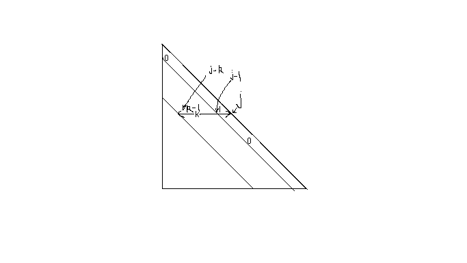
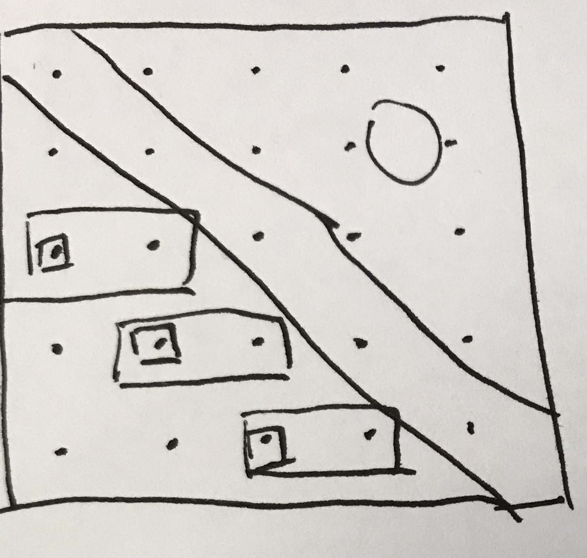

---

```{r setup, include=FALSE}
knitr::opts_chunk$set(echo = TRUE)
```

I start with the [@An:2014jc] which is the frequecy part of the banded-width test, and another approach is done by [@Cheng:2017jh]. The main differences between this two is @An:2014jc use the modified cholesky decomposition to modelling the precision matrix and directly model the covariance matrix by the autoregression form. @Cheng:2017jh use another approach can describe as "one-left" regression form by T.W. Anderson (2003), then transfered the problem to the covariance structre of the residuals of the regression. Then he constructed the test statistic by using the sum of non-banded entry of the residual covariance matrix. @An:2014jc use the only $j-k$ sub-diagonal entry of cholesky factor to construct the test statistic instead. The difference also showed in the Hypotheses. The hypothesis for @Cheng:2017jh is "Whether bandwidth is $\gamma$ or not". The hypothesis for @An:2014jc is "$K\leqslant k-1$" or "$K\leqslant k$".

---

Another approach by @Lee:2018vj is a similar method by @An:2014jc, however he used Bayesian methods rather than the frequency methods. Under the Bayesian set, the hypothesis is construct by bayes factor rather than a statistics follow a certain distribution.

@Lee:2017uq also showed a method using modified Cholesky decomposition to estimate precision matrix. k-banded Cholesky prior

@Lee:2018vj mainly concerned at the consistency of bandwidth selection and Bayes factor. (However, I am not too care about this, I mainly care about the methodology using to estimate the bandiwidth K and the precision matrices.)

---

The content upon slightly summarized the introduction part by @Lee:2018vj, then I will repeat this procedure for @An:2014jc and @Cheng:2017jh . Other interesting papers mentioned in their introduction will also introduced.

After the summary of introduction, is the model building and example approach. It is interesting to see they use the covariance modelling method in very different models. A example is the mean-covariance model in longitudinal data by @Pan:2017il and [@Pourahmadi:2000fs] analysis which involve the polynomial of time and lag-time to modelling the covariance matrices. Another example is @Lee:2018vj which use the Gaussian DAG Models which has band-structured covariance/precision matrices.

---

Not only for the LDA data, estimation of the covariance matrices is also important for principle component analysis (PCA), linear/quadratic distriminant analysis and multivariate analysis of variance (MANOVA)


---

n>>p case, sample covariance fails to converge to the true covariance matrix [@Johnstone:tc]. 


--- 

## Appendix : Detail notes about each three papers

Review for @Lee:2018vj
---

Another from @Lee:2018vj should be considered is @Banerjee:2015ex . This paper is mainly concern about the graphical model structure, a sparse precision matrix of a Gaussian graphical model. The edge presents or absences in a graphical model describing conditional independence. A popular Non-Bayes method is graphical lasso. This paper use bayesian method instead, use posterior distribution to learn the covariance structure.G-Wishart prior is mentioned here.
### The model specification:

Gaussian DAG model by [@Lee:2018vj] .
DAG: Directed acyclic graph.

Direct graph: $\mathcal { D } = ( V , E )$ ,V is vertices $V = \{ 1 , \ldots , p \}$ , E is directed edges. For any $i,j\in V$, $(i,j)\in E$ as a directed edge $i\rightarrow j$. There is no cycle in a DAG model. Assume parent ordering is known, where $i<j$ holds for any parent i of j in a DAG $\mathcal D$. Gaussian DAG model over $\mathcal D$ : $Y = \left( Y _ { 1 } , \ldots , Y _ { p } \right) ^ { T } \sim N _ { p } \left( 0 , \Omega _ { n } ^ { - 1 } \right)$ satisfies:
$$
Y _ { i } \perp \left\{ Y _ { j } \right\} _ { j < i , j \in p a _ { i } ( \mathcal { D } ) }|  \left\{ Y _ { j } \right\} _ { j \in p a _ { i } ( \mathcal { D } ) }
$$

Consider,

$$
\begin{align}
X _ { 1 },\ldots , X _ { n } | \Omega_{ n } \overset{i.i.d}{\sim} N _ { p } \left( 0 , \Omega _ { n } ^ { - 1 } \right)
\end{align}
$$

#### Cholesky Decomposition (Slight different from Pourhmadi)
Do the Cholesky decomposition as following form :
$$
\Omega _ { n } = \left( I _ { p } - A _ { n } \right) ^ { T } D _ { n } ^ { - 1 } \left( I _ { p } - A _ { n } \right)
$$
with $D_n=diag(d_j)$, $a_{jj}=0$. Called $A_n$ *Cholesky factor* is unique and lower triangular matrix. 
Result: $a_{jl}\neq0$ iff $l\in pa_j(\mathcal D)$. Description: $a_{jl}$ not 0 iff l is parent of j, the edge $l\rightarrow j$ exists.
Model: 
$$
\begin{array}
{ c } { X _ { i 1 } | d _ { 1 } \overset { i . i . d } { \sim } N \left( 0 , d _ { 1 } \right) } \\ 
{ X _ { i j } | a _ { j } ^ { ( k ) } , d _ { j } , k \overset { i n d } { \sim } N \left( \sum _ { l = ( j - k ) _ { 1 } } ^ { j - 1 } X _ { i l } a _ { j l } , d _ { j } \right) , \quad j = 2 , \ldots , p} 
\end{array}
$$
That is, showed in above figure

A very useful result:
For Cholesky decomposition upon, the bandwidth of $A_n$ is k iff bandwidth of $\Omega_n$ is $k$. 

以上思路是，如果该阵是banded，那么经过cholesky变换以后，也应该是banded。

突然想起来一点，an和cheng写的统计量构造是通过banded以后，那些应该为0的部分的和是否靠近0为点进行构造的。


断点数据：抄完了 Bayesian Test and Selection for Bandwidth of High-dimensional Banded Precision Matrices 的模型数据。
下一步：要么继续写这篇文章的Hypothesis构造的算法，要么去抄An(2014)和 Cheng(2017）模型构造以及构造细节。

Prior Distribution I'm not that concerned yet, however, should notice that it is the conjugate prior. So the posterior distribution can be calculated in a closed form up to some normalizing constant.

Assumption is important for the proof of estimation consistency, however, I regards this is "not neccessary" for the idea of method, so omit in this review.
But I think the explaination in Section 2.4 is good and worth reading if involve the proof of consistency and other property.

### Main result:
1. Bandwidth selection consistency

2. Consistency of One-Sample Bandwidth Test
Here construct a Bayesian bandwidth test for the testing problem:
$$
H_0:k\leqslant k^* \ \textit{vs }\ H_1:k>k^* 
$$
This is a composite hypothesis.
The hypothesis test is based on the Bayes factor $B_{10}(X_n)$ defined by the **ratio of marginal likelihoods** ,
$$
B_{10}(X_{n})=\frac{p(X_n|H_1)}{p(X_n|H_0)}
$$
Denote the prior under the hypothesis $H_i$ as $\pi_i(A_n,D_n,k)$ for $i=0,1.$ Using prior $\pi_0(k)$ and $\pi_1(k)$ such that
$$
\begin{array} { l l } { \pi _ { 0 } ( k ) = C _ { 0 } ^ { - 1 } \pi ( k ) , \quad k = 0,1 , \ldots , k ^ { * } } \\ { \pi _ { 1 } ( k ) = C _ { 1 } ^ { - 1 } \pi ( k ) , \quad k = k ^ { \star } + 1 , \ldots , R _ { n } } \end{array}
$$
with $C _ { 0 } = \sum _ { k = 0 } ^ { k ^ { * } } \pi ( k )$, $C _ { 1 } = \sum _ { k = k ^ { * } + 1 } ^ { R _ { n } } \pi ( k )$.
Then the Bayes factor (the statistic we construct for Hypothesis), is in analytic form,
$$
\begin{aligned} B _ { 10 } \left( \mathbf { X } _ { n } \right) & = \frac { \sum _ { k > k ^ { * } } \int p \left( \mathbf { X } _ { n } | \Omega _ { n } , k \right) \pi \left( \Omega _ { n } | k \right) \pi _ { 1 } ( k ) d \Omega _ { n } } { \sum _ { k \leq k ^ { * } } \int p \left( \mathbf { X } _ { n } | \Omega _ { n } , k \right) \pi \left( \Omega _ { n } | k \right) \pi _ { 0 } ( k ) d \Omega _ { n } } \\ & = \frac { \pi \left( k > k ^ { * } | \mathbf { X } _ { n } \right) } { \pi \left( k \leq k ^ { * } | \mathbf { X } _ { n } \right) } \times \frac { C _ { 0 } } { C _ { 1 } } \end{aligned}
$$
Consistency result:
Under $H_0:k\leq k^*$
$$
B _ { 10 } \left( \mathbf { X } _ { n } \right) = O _ { p } \left( T _ { n , H _ { 0 } , k _ { 0 } , k ^ { * } } \right)
$$
Under $H_1$
$$
B _ { 10 } \left( \mathbf { X } _ { n } \right) ^ { - 1 } = O _ { p } \left( T _ { n , H _ { 1 } , k _ { 0 } , k ^ { * } } \right)
$$

Then is the method comparison between [@An:2014jc; @Cheng:2017jh] and it's method. The mainly concern also is the consistency.

>It is curious about the problem that how the test work, which means significance under such bayes factor, such ratio? 

Quote from the arthor.

> If $H_0$ is true, $B_{10}(Y)$ decreases at rate $O_p(e^{-c_0(k_2-k_1)})$ for some constant $c_2>0$. On the other hand, if $H_1$ is true, $B_{10}(Y)^{-1}$ decreases exponentially with $n(k_2-k_1)\beta^2_{min}$. 

So there should be some threshold for the ratio about "decline the null-hypothesis" or the "accept the alter-hypothesis" like 1 or 0.95 something.
Back to the form of the Bayes factor : $B_{10}(X_{n})=\frac{p(X_n|H_1)}{p(X_n|H_0)}$ ,if $H_0$ is true, then the denominator is larger than the numerator, bayes factor is closer to 0.
If $H_1$ is true, then numerator $p(X_n|H_1)$ should be larger than the denominator. Then the inverse of the Bayes factor should closer to 0. 

As [Bayes factor] (https://en.wikipedia.org/wiki/Bayes_factor) give a slightly discussion about the explaination of the bayes factor. It seems no trivial maps from frequency 5\% level significance with test under Bayes factor.


Because as it says, [@An:2014jc; @Cheng:2017jh]'s result is that the statistic they constructed is asymptotically under Normal distribution, then it comes to the normal 95\% hypothesis-test-framework. Need notice, the asymptotically achieve for
$n \wedge p \rightarrow \infty$ rather than $n \rightarrow \infty$.

> Q : How the bayes factor linked with the Cholesky decomposition?

> A: Insider the analytic form of Bayes factor: $p(X_n|\Omega_n,k)$ and $\pi(\Omega_n|k)$

3. Two-Sample Bandwidth Test

Problem:
$$
\begin{array} { c } { X _ { 1 } , \ldots , X _ { n _ { 1 } } | \Omega _ { 1 n _ { 1 } } \stackrel { i . i . d . } { \sim } N _ { p } \left( 0 , \Omega _ { 1 n _ { 1 } } ^ { - 1 } \right)} \\ { Y _ { 1 } , \ldots , Y _ { n _ { 2 } } | \Omega _ { 2 n _ { 2 } } \stackrel { i . i . d } { \sim } N _ { p } \left( 0 , \Omega _ { 2 n _ { 2 } } ^ { - 1 } \right) } \end{array}
$$
Interesting question: 
Test of equality between two bandwidths $k_1$and $k_2$.
Hypothesis:
$$
H _ { 0 } : k _ { 1 } = k _ { 2 },H _ { 1 } : k _ { 1 } \neq k _ { 2 }
$$
Bayes factor:
$$
B _ { 10 } \left( \mathbf { X } _ { n _ { 1 } } , \mathbf { Y } _ { n _ { 2 } } \right) = \frac { p \left( \mathbf { X } _ { n _ { 1 } } , \mathbf { Y } _ { n _ { 2 } } | H _ { 1 } \right) } { p \left( \mathbf { X } _ { n _ { 1 } } , \mathbf { Y } _ { n _ { 2 } } | H _ { 0 } \right) }
$$

> How to investigate the posterior/probability under the $H_1$ $p(X_{n1},Y_{n_2})$?

To answer this question, should deep in P14 the construction and the specifying of the prior distribution inside $a_{1,j}^{(k_0)}$ and $a_{1,j}^{(k_1)}$ for given $k_0$ and $k_1$.

Then the Bayes factor can be written as analytic form under the prior given
$$
B _ { 10 } \left( \mathbf { X } _ { n _ { 1 } } , \mathbf { Y } _ { n _ { 2 } } \right) = \frac { \sum _ { k _ { 1 } \neq k _ { 2 } } \pi \left( k _ { 1 } | \mathbf { X } _ { n _ { 1 } } \right) \pi \left( k _ { 2 } | \mathbf { Y } _ { n _ { 2 } } \right) } { \sum _ { k _ { 1 } = k _ { 2 } } \pi \left( k _ { 1 } | \mathbf { X } _ { n _ { 1 } } \right) \pi \left( k _ { 2 } | \mathbf { Y } _ { n _ { 2 } } \right) } \times R _ { n } ^ { - 1 }
$$

Use marginal posterior distribution to deal with the alternative hypothesis $k_1\neq k_2$. And arthor gives a theorem about the consistency of such test.

Here we finish the review of [@Lee:2018vj]

---

Here start review about [@An:2014jc] .
Summary about introduction. (Will insert to begining of the final ediction of review.)

"When the data are multivariate Gaussian, the precision matrix can be used to infer the conditional dependence structure of random variables." Link between Precision matrix and conditional dependency structure (Problem: Only for Gaussian? )

"When the variables of interest have a natural order, it is often assumed that two random variable are not partially correlated when the distance between the is large enough." 
It is interesting to do such assumption, or just intuitively idea. There are things are done by this sentence, one is the "prior" of the importantce of variable has order and is already known. Then, the “most interesting” with "less interesting" variable are less correlated.
However, this may not true in some situation, and may cause misleading in prior assumption. 

> That is, another problem rised here, how to decide the order of the variables, for banded structure, the covariance/precision matrix may differ for $X_1,X_2,...X_n$ from $X_{i_1},...,X_{i_n}$ because the banded covariance structure showed the dependency from a variable to others is only on its neighbor. How to choose a satisfied order of indeces $I$ ? How about the precision matrices? (Under Gaussian is same? How about other distributions?)

### Model specification & Notations
$X _ { i } ( i = 1 , \dots , n )$ observation collected from the ith subject.
$X _ { i } = \left( X _ { i 1 } , \ldots , X _ { i p } \right) ^ { \mathrm { T } } \in \mathbb { R } ^ { p } ( i = 1 , \dots , n )$ p-dimensional vector which are *independent* and *normally distributed* with mean 0 and covariance matrix $\Sigma$.

> Notice: the collected data $X$ is assume as multivariate Normal, and without a respond Y, so it is *NOT* a regression problem.

MCD(modified cholesky decomposition) of $\Sigma$ is denoted by $\Sigma = L D L ^ { \mathrm { T } }$, correspond formula in precision matrix is $\Omega = T ^ { \top } D ^ { - 1 } T$.
Estimating $T$, $D$ is equivelant to estimate $\Omega$ and $\Sigma$. Similarly we have the autoregressive property in such notation as
$$
X _ { i j } = \sum _ { q = 1 } ^ { j - 1 } \left( - t _ { j q } \right) X _ { i q } + \varepsilon _ { i j }
$$
for banded structure with bandwidth=$K_0$ , we have
$$
X _ { i j } = \sum _ { q = \left( j - K _ { 0 } \right) _ { 1 } } ^ { j - 1 } \left( - t _ { j q } \right) X _ { i q } + \varepsilon _ { i j }
$$

Hypothesis:
$$
H_0: K\leqslant k-1 \text{   vesus } H_1:K\geqslant k
$$
k is prespecified positive number smaller than $n-4$.
Define $\mathcal { X } = \left( X _ { 1 } , \dots , X _ { n } \right) ^ { \mathrm { T } }$ 
By fitting the autoregression equation, the estimator for $t^{(k)}_j$ as $\hat { t } _ { j } ^ { ( k ) } = - \left( \mathcal { X } _ { j } ^ { ( k ) \tau } \mathcal { X } _ { j } ^ { ( k ) } \right) ^ { - 1 } \mathcal { X } _ { j } ^ { ( k ) \mathrm { T } } \mathcal { X } _ { j }$. Estimation for $d_j$ as $\hat d_j^{(k)}=\left\| \mathcal { X } _ { j } + \mathcal { X } _ { j } ^ { ( k ) } \hat { t } _ { j } ^ { ( k ) } \right\| ^ { 2 } / \left[ n - \left\{ j - ( j - k ) _ { 1 } \right\} \right]$.

>Surprise: finally an example that directly get the estimation by the mcd.

> Idea: can we do the autoregression between variables to obtain the sparse covariance structure? such as $X_j=\sum_{i=1,i\neq j}^n \beta_i X_i$, test the significant to 0 for $\beta$ or regularized method to obtain the dependence structure for $X_1,...,X_n\sim N(0,\Sigma)$. Then we change the order of the variables we can obtain a banded structure. Under such model, the bandwidth may change, so can we develope a more specific test for $k_i$ ?

*When $H_0$ is true, then $t_{j,j-k}=0$ for every $j>k$. Then the corresponding estimators should be small.* Follow this idea, the test statistic is constructed as 
$$
L=\sum_{j=k+1}^p \hat t_{j,j-k}^{(k)2}
$$

The distribution, or approximate distribution of the test statistic is needed for an accurate testing procedure.

From the construction, the statistic consider the difference between "$k$-banded" with "$(k-1)$-banded", that is, showed in the figure below:

{width=200px}

here is p=5,k=2 structure matrix.

The $t^{(k)}_j$ is the rectangle box of vector, the statistics L is the sum square of small square entry. It is the "outer-wall" of k-banded with (k-1)-banded.

Result by [@Wu:2003fk]: Conditonal on $\mathcal X_j^{(k)}$,  $\hat t_{j,j-k}^{(k)}\sim N(t_{j,j-k},\Delta_j\hat d_j^{(k)})$ where $\Delta _ { j } = \left\{ \mathcal { X } _ { j - k } ^ { \mathrm { T } } \mathcal { X } _ { j - k } - \mathcal { X } _ { j - k } ^ { \mathrm { T } } \mathcal { X } _ { j } ^ { ( k - 1 ) } \left( \mathcal { X } _ { j } ^ { ( k - 1 ) \mathrm { T } } \mathcal { X } _ { j } ^ { ( k - 1 ) } \right) ^ { - 1 } \mathcal { X } _ { j } ^ { ( k - 1 ) \mathrm { T } } \mathcal { X } _ { j - k } \right\} ^ { - 1 }$.

We have $\hat t_{j,j-k}^{(k)}$ is Normal, then the $\left( \Delta _ { j } \hat { d } _ { j } ^ { ( k ) } \right) ^ { - 1 / 2 } \left( \hat { t } _ { j , j - k } ^ { ( k ) } - t _ { j , j - k } \right)\sim t_{n-k}$. 

Then $\left( \hat { t } _ { j , j - k } ^ { ( k ) } - t _ { j , j - k } \right) ^ { 2 } / \left( \Delta _ { j } \hat { d } _ { j } ^ { ( k ) } \right)\sim F_{1,n-k}$.

Take $l_j$ defined as $\hat { t } _ { j , j - k } ^ { ( k ) 2 } / \left( \Delta _ { j } \hat { d } _ { j } ^ { ( k ) } \right)$ , modified $L$ as $L _ { c } = \sum _ { j = k + 1 } ^ { p } l _ { j }$ 

Even more, the variance may different for each j, from the $\hat t_j^{(k)}$ may different. Then need modified again by standardize it. We have $l_j\sim F_{1,n-k}$ with $E(l_j)=(n-k)/(n-k-2)$ and $var(l_j)=2(n-k)^2(n-k-1)/ \left\{ ( n - k - 2 ) ^ { 2 } ( n - k - 4 ) \right\}$

$$
L _ { f } = ( p - k ) ^ { - 1 / 2 } \sum _ { j = k + 1 } ^ { p } \frac { l _ { j } - E \left( l _ { j } \right) } { \operatorname { var } \left( l _ { j } \right) ^ { 1 / 2 } }
$$
Then the asymptotic null distribution of $L_f$ as $n,p\rightarrow \infty$ is standard Normal.

After this, the arthor showed the power of the test.

### Procedure of the test
Consider the hypothesis test below:
$$
H _ { 0 k } : K \leqslant k - 1 \quad \text { versus } \quad H _ { 1 k } : K \geqslant k , \quad 1 \leqslant k \leqslant M
$$
Then we can estimate bandwidth by $K_0=\{H_{0k} \text{ is false}\}$.

##### Algorithm1:

1. Specify significance level $\alpha$, upper bound of k: $M$
2. k=0, stop, output $\hat K=k$,otherwise, compute the test-statistics $L_f$ , denoted by $L_f^{(k)}$. Let $p_k=2\{1-\phi(|L_f^{(k)}|)\}$. 
3. Test: if $p_k>\alpha_k$, then do not reject $H_{0k}$ , and update $k=k-1$, back to Step 2. If $p_k\leqslant \alpha_k$, reject $H_{0k}$ and stop, report the bandwidth as $\hat K=k$

Notice: This is a multiple comparison procedure, whould control each $\alpha_k$ in order to control overall significance level $\alpha$. Refer @Efron:2010jd for multiple comparison of hypothesis tests. Use Bonferroni procedure sets $\alpha_k=\alpha/M$ to control familywise error so that it is no larger than $\alpha$.

Bonferroni procedure may be too conservative when number of tests is relative large. @Holm:1979ws proposed following procedure:

##### Algorithm2:
1. Initialize $\alpha$.
2. For k=1,...,M compute test statistics $L_f^{(k)}$. $p_k=2\{1-\phi(|L_f^{(k)}|)\}$
3. Sort $p_k$ as $p _ { ( 1 ) } \leqslant \cdots \leqslant p _ { ( M ) }$ with correpond $H_{0j_i},\cdots,H_{0j_M}$. Reject $H_{0j_k}$ if $p _ { ( j ) } \leqslant \alpha / ( M - j + 1 )$ for all $j=1,...,k$.
4. No $H_0$ is rejected: output $\hat K=0$,implies diagonal matrix. Otherwise, $\hat K=max\{k:H_{0k}\text{ is rejected}\}$.


--- finish this paper review.

---

Now start for review @Cheng:2017jh 

Data involve: genetic regulatory networks: gene expression data, medical imaging, risk management and web search problems.

Data example:
levels of $p$ genes denotes as $(Y_1,...,Y_p)$ , a concentration network can be described by an undirected graph in which the p vertices represent the p genes and an edge connects gene i and gene j iff the partial correlation $\rho_{ij}$ between $Y_i$ and $Y_j$.

Such model can describe by an undirected graph is which the pvertices represent the p genes and an edge connects gene i and gene j if and only if the partial correlation $\rho_{ij}$ between $Y_i$ and $Y_j$ is non-zero.

> So in this description, the model is Markov random field ? : Undirected graph

Edge connected $Y_i$ and $Y_j$ iff partial correlation $\rho_{ij}$ is non-zero. If $\left( Y _ { 1 } , \dots , Y _ { p } \right)$ are jointly normally distributedm, estimating the structure of undirected graph is equivalent to recovering the support of precision matrix ($\Omega=\Sigma^{-1}$)

> Question: Just Gaussian graphical model for undirected model works? why only undirect. [@Lee:2018vj] is work on DAG, and [@An:2014jc] is work on multi-variable Normal without any specification such as graphical model.

Normal property for this, see @Lauritzen:1996te .

Introduction part is interesting to collect wide range of papers.
[@Bickel:2008ez] is very important, have to read it all.
[@Rothman:2010cy] is also important, seems first use Cholesky factor to model such covariance matrices. (But it seems too late? But we should trust Biometrika). But seems I omit it for now.

#### Notation and Model specification

$\mathbf Y = (Y_1,...,Y_p)'$ : p-dimension vector sith mean $\mu$ and covariance matrix $\Sigma_y=(\sigma_{y,ij})_{p\times p}=\Omega^{-1}=(\omega_{ij})_{p\times p}$ 

$\mathcal B_{\gamma}$ is a class of banded matrices with bandwidth $\gamma$. A matrix $\mathbf A=(a_{ij})$ is said to belong to $\mathcal B_{\gamma}$ if its elements ($a_{ij}$) are satisfies $a_{ij}=0$ if $|i-j|>\gamma$. (The full-scale of bandwidth, then the cholesky factor bandwidth should be $\frac{\gamma}{2}$)

Hypothesis test problem:
$$
H_{\gamma,0}:\Omega\in \mathcal B_\gamma \text{ vs. } H_{\gamma,1}:\Omega\notin \mathcal B_{\gamma}
$$

Remark: @Bickel:2012ek showed: If $\Omega$ belongs to $\mathcal B_\gamma$, there exists $G_y\in B_{c\gamma}$ and $\Sigma_y$ can be approximated by $G_y$ in the sense of $||\Sigma_y-G_y||\leq ( 1 / m ) ( ( M - m ) / ( M + m ) ) ^ { c }$ (for every $c\in N_0$). $||\cdot||$ is spectral norm. $M$ and $m$ are largest and smallest eigenvalues of $\Omega$. 
An efficient method of testing the banded structure of $\Sigma_y$ due to @Qiu:2012jy .

##### Test Statistic:
$B _ { \gamma } ( \Omega ) = \left( \omega _ { i j } I \{ | i - j | \leq \gamma\} \right)$ is a banded version of $\Omega$ with bandwidth $\gamma$. Then the difference between $\Omega$ and $B_\gamma(\Omega)$ should be small if null hypothesis is true.

The measurement of the difference between two matrices used in this paper is matrix's Frobenius norm $\operatorname { tr } \left( \Omega - B _ { \gamma } ( \Omega ) \right) ^ { 2 }$. Because it is easier to analysis.

Under the null hypothesis, then we have $\operatorname { tr } \left( \Omega - B _ { \gamma } ( \Omega ) \right) ^ { 2 } = \sum _ { | i - j | > \gamma } \omega _ { i j } ^ { 2 } = 0$ 


Let 
$$
Y_i=\alpha_i+Y'_{-i}\beta_i+\epsilon_i
$$
$\beta_i$ is a $p-1$ vector $\left( \beta _ { 1 , i } , \ldots , \beta _ { i - 1 , i } , \beta _ { i + 1 , i } , \ldots , \beta _ { p , i } \right) ^ { \mathrm { T } }$, which satisfies


$$
\boldsymbol { \beta } _ { i } = - \frac { \Omega _ { - i , i } } { \omega _ { i i } } , \quad \text { and } \quad \operatorname { Cov } \left( \epsilon _ { i } , \epsilon _ { j } \right) = \frac { \omega _ { i j } } { \omega _ { i i } \omega _ { j j } }
$$
$\operatorname { tr } \left( \Omega - B _ { \gamma } ( \Omega ) \right) ^ { 2 } = 0$  implies $\sum _ { | i - j | > \gamma } \sigma _ { \epsilon , i j } ^ { 2 }=0$.

$\Sigma _ { \epsilon } = \left( \operatorname { Cov } \left( \epsilon _ { i } , \epsilon _ { j } \right) \right) _ { p \times p } = \left( \sigma _ { \epsilon , i j } \right) _ { p \times p }$.

Under such notation, $\Sigma_\epsilon$ belons to $\mathcal B_\gamma$ if and only if $\Omega$ belongs to $\mathcal B_\gamma$.

An unbiased estimator of $\sigma _ { \epsilon , i j } ^ { 2 }$ :
$$
\tilde { \sigma } _ { \epsilon , i j } ^ { 2 } = \left\{ \frac { 1 } { P _ { n } ^ { 2 } } \sum _ { k l } ^ { * } \left( \epsilon _ { k i } \epsilon _ { k j } \right) \left( \epsilon _ { l i } \epsilon _ { l j } \right) - 2 \frac { 1 } { P _ { n } ^ { 3 } } \sum _ { k l s } ^ { * } \left( \epsilon _ { k i } \epsilon _ { k j } \right) \left( \epsilon _ { l i } \epsilon _ { s j } \right) + \frac { 1 } { P _ { n } ^ { 4 } } \sum _ { k l s t } ^ { * } \left( \epsilon _ { k i } \epsilon _ { l j } \right) \left( \epsilon _ { s i } \epsilon _ { t j } \right) \right\}
$$

location invariant statistic :
$$
T _ { n \gamma } : = \sum _ { | i - j | > \gamma } \tilde { \sigma } _ { \epsilon , i j } ^ { 2 }
$$
$T_{n\gamma}$ is cannot be observed due to $\epsilon$ is unobserved. Denote the residuals as
$$
\hat { \epsilon } _ { k i } = Y _ { k i } - \hat { \alpha } _ { i } - Y _ { k , - i } ^ { \prime } \hat { \boldsymbol { \beta } } _ { i } = Y _ { k i } - \overline { Y } _ { i } - \left( \boldsymbol { Y } _ { k , - i } ^ { \prime } - \overline { \boldsymbol { Y } } _ { - i } ^ { \prime } \right) \hat { \boldsymbol { \beta } } _ { i }
$$
use estimator instead of real error term in $\tilde \sigma^2_{\epsilon,ij}$, then obtain a U statistic as
$$
\hat { \sigma } _ { \epsilon , i j } ^ { 2 } = \left\{ \frac { 1 } { P _ { n } ^ { 2 } } \sum _ { k l } ^ { * } \left( \hat { \epsilon } _ { k i } \hat { \epsilon } _ { k j } \right) \left( \hat { \epsilon } _ { l i } \hat { \epsilon } _ { j j } \right) - 2 \frac { 1 } { P _ { n } ^ { 3 } } \sum _ { k l s } ^ { * } \left( \hat { \epsilon } _ { k i } \hat { \epsilon } _ { k j } \right) \left( \hat { \epsilon } _ { l i } \hat { \epsilon } _ { s j } \right) + \frac { 1 } { P _ { n } ^ { 4 } } \sum _ { k l s t } ^ { * } \left( \hat { \epsilon } _ { k i } \epsilon _ { j j } \right) \left( \hat { \epsilon } _ { s i } \hat { \epsilon } _ { t j } \right) \right\}
$$

Then alternative for $T_{n\gamma}$ as $T'_{n\gamma}= \sum _ { | i - j | > \gamma } \hat { \sigma } _ { \epsilon , i j } ^ { 2 }$.

Then $(T_{n\gamma}-T'_{n\gamma})/\sqrt{Var(T_{n\gamma})}\rightarrow 0$ in probability under certain conditions.

Following is the asymptotically theory and converge for such statistic and the assumption for the asymptotically proportion.


# References:


